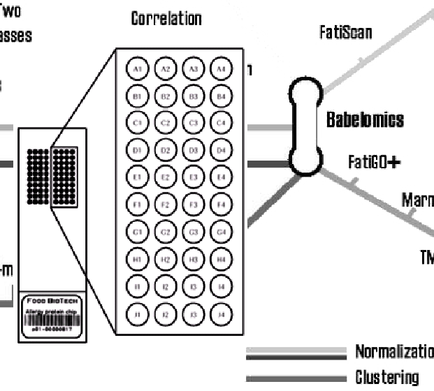
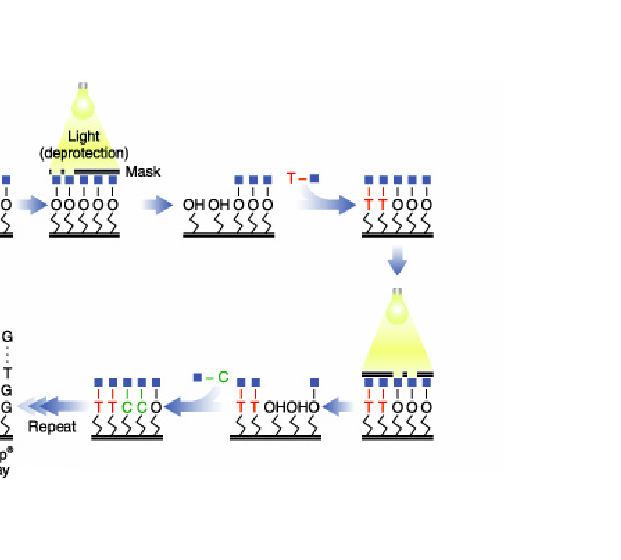
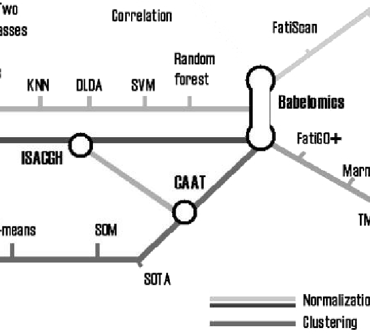

# Introduccion a los microarrays y otras tecnologías omicas

## Antecedentes históricos

La biología molecular ha estado interesada desde sus comienzos en poder determinar
 el nivel de expresión de los genes integrados en el genoma humano. Para ello dispone desde hace años de múltiples técnicas para medir estos niveles, tales como el<tt> Northern blot</tt> (a nivel de ARN) o el <tt>Western blot</tt> (a nivel de proteína).

Especial interés ha tenido siempre sobre las otras biomoléculas el estudio de los niveles del ARN transcrito. Hace unos años se
acuñó el término de _transcriptómica_ para referirse al estudio del ARN en cada una de sus formas.
La transcriptómica ha contribuído a tener una mejor comprensión de la patogénesis de las enfermedades.

En el año 2009 Wang y colaboradores (@Wang:2009) definieron el transcriptoma como _el conjunto completo de tránscritos en una célula y su cantidad en un momento determinado  del desarrollo o en una determinada condición fisiológica_. 
Como objetivos de la transcriptómica se han definido tres principales:

1. Catalogar todas las especies de tránscritos, incluyendo ARNm, ARN no codificante y pequeños ARNs.

1. Determinar la estructura transcripcional de los genes, en términos de sus puntos 5' de inicio y 3' de finalización,
las modificaciones post-transcripcionales y los patrones de splicing.

1. Cuantificar los diferentes niveles de expresión de cada tránscrito durante el desarrollo y bajo diferentes condiciones.

El interés de la transcriptómica no solamente se ha centrado en el desarrollo de nuevas tecnologías que mejoran su estudio,
sino también en el desarrollo de nuevos métodos de extraer la gran cantidad de información que se genera con estas nuevas técnicas.


## Los microarrays

Una de las técnicas que revolucionó el estudio del transcriptoma fueron los microarrays.

Un _microarray_ es un artefacto para la realización de experimentos que permite estudiar simultáneamente múltiples unidades,
b que representan los genes, proteínas o metabolitos, sobre un sustrato sólido de cristal,
plástico o sílice, y expuestos a la acción de las moléculas diana cuya expresión se desea analizar (ver Figura \@ref(fig:c01microarray).


```{r c01microarray,  fig.align='center', fig.cap="Imagen de un microarray", echo=FALSE}

```


La utilización de los microarrays en la última década ha generado inmensas cantidades de datos útiles para el estudio y el desarrollo de enfermedades,
dando a conocer múltiples mapas de expresión génica, encontrar biomarcadores o construir firmas génicas para determinadas enfermedades.

Lo que caracteriza a los nuevos métodos utilizados para estudiar el transcriptoma no es lo que pueden medir, sino la cantidad de mediciones
simultáneas que pueden realizar.  Mientras que hasta hace apenas una década se estudiaban los genes uno a uno en profundidad, a partir del uso de estas nuevas tecnologías se
pueden estudiar muchísimos genes a la vez, pero en contrapartida con mucho menos detalle y más ruído.

Los microarrays, hoy una metodología bien consolidada, han sido cruciales para concebir una nueva manera de estudiar el transcriptoma, especialmente en el campo de la expresión génica. Después de ellos han venido otras técnicas que tienen en común con ellos el "alto rendimiento" es decir la capacidad para medir muchas variables --cientos o miles-- a la vez. Entre estas técnicas podemos destacar los arrays de SNPs, los microRNAs, la metilación y especialmente la secuenciación de nueva generación.

### Aplicaciones de los microarrays

La tecnología de los microarrays se ha aplicado a una inmensa variedad de problemas, desde el estudio de enfermedades como el cáncer o la
esclerosis múltiple al de los ritmos circadianos de las frutas.
Entre otros temas los microarrays se han aplicado a:

* Estudio de genes que se expresan diferencialmente entre varias condiciones (sanos vs enfermos, mutantes vs salvajes, tratados vs no tratados) (@Callow:2000, @Hedenfalk:2002, @Kupin:2006).
* Clasificación mólecular en enfermedades complejas (@Golub:1999, @Barrier:2005).
* Identificación de genes caracerísticos de una patología (firma o "signature") (@dyrskjot:2002).
* Predicción de respuesta a un tratamiento (@Lin2006).
* y una gran variedad de otros temas


## Cómo funcionan los microarrays

En términos generales los microarrays funcionan mediante la hibridación de una sonda específica ("probe") y una molécula diana ("target").
La hibridación que ha tenido lugar se detecta mediante fluorescencia y se visualiza con la ayuda de un escáner. Los niveles de fluorescencia
detectados reflejan la cantidad de moléculas diana presentes en la muestra problema.

Existen diferentes tipos de microarrays según la naturaleza del "target" que se está estudiando. Podemos encontrar microarrays de protéinas,
de tejidos, de ADN o de ARN (también llamados de expresión). En este curso nos centraremos en los microarrays de expresión génica aunque
al final del capítulo se hace mención de algunos de los otros tipos de microarrays que existen.

Una clasificación habitual de los microarrays es por el número de muestras que se hibridan simultáneamente. Distinguimos:

1. Microarrays de dos colores o "spotted arrays"
2. Microarrays de un color o arrays de oligonucleótidos.


### Microarrays de dos colores

Estos arrays aparecieron a mediados de los años 90 (@Schena:1999)
y están basados en la _hibridación competitiva_ de dos muestras, cada una de las cuales ha sido marcada con un marcador fluorescente
diferente (normalmente Cy3 y Cy5, verde y rojo respectivamente).

En el array se imprimen las sondas (una sonda$\simeq$ un gen) cuyas secuencias se obtienen de información almacenada en bases de datos de secuencias como  <tt>GenBank</tt>, <tt>dbEST</tt>, etc.


```{r c01microarray2col, fig.align='center', fig.cap="En los microrrays de dos colores las sondas son sintetizadas _in vitro_ y depositadas directamente sobre una superficie de cristal", echo=FALSE}
knitr::include_graphics("epsimages/c01microarray2col.png")
```


El ARN de las muestras problemas es extraído y posteriormente marcado con los
 marcadores fluorescentes, según a que grupo a comparar pertenezcan.
Las muestras marcadas se mezclan y se hibridan sobre el array.
La hibridación consiste en combinar la muestra (target) y el microarray (sondas) y dejarlos un tiempo en una cámara de hibridación a
una temperatura y agitación determinadas.
Las sondas que tengan secuencias complementarias en las muestras, se hibridarán con ellas y quedaran fuertemente adheridas.
Pasadas unas horas se lava el microarray para eliminar los "targets" que no se hayan hibridado. Después de la hibridación el array se ilumina con un láser que provoca que el marcador fluorescente emita fluorescencia de uno u
otro color generando dos imágenes que se superpondrán para su análisis conjunto.
La cantidad de fluorescencia generada es proporcional a la cantidad de ARNm presente en la muestra problema. El resultado final es un valor que
representa el nivel de expresión de una muestra respecto a la otra por lo que se le denomina expresión _ relativa_.

### Microarrays de un color 

Como su propio nombre indica, en estos arrays las muestras están marcadas únicamente con un marcador fluorescente.
En cada array solamente se hibrida una muestra, por lo que no se da la hibridación competitiva como pasaba en los arrays de dos colores.
El valor que se obtiene después de iluminar el array con el láser es una medida numérica que se obtiene directamente del escaner, es decir no está referida al valor de otra muestra por lo que recibe el nombre de expresión _absoluta_.


#### Fabricación de los arrays de oligonucleótidos

La empresa Affymetrix (Santa Clara, California) es la casa comercial líder en la manufacturación y venta de este tipo de microarrays.
Affymetrix sintetiza las sondas directamente sobre el chip mediante un proceso llamado fotolitografía.
Este proceso consiste en la adición cíclica de los cuatro nucleótidos (adenina, timina, citosina y guanina)
sobre la superficie rígida, donde existen ancladas unas especies químicas reactivas que se protegen y desprotegen para añadir el
nucleótido deseado, mediante ciclos de luz y oscuridad. Así se consigue la síntesis de oligonucleótidos de unos 25-mer ("mer"=bases) de longitud.
En la figura  @ref(fig:c01affymetryxsynthesis)
se esquematiza el proceso.


```{r ,  fig.align='center', fig.cap="Esquema del proceso de fabricación de arrays de oligonucleótidos", echo=FALSE}

```

Cada oligonucleótido sintetizado de 25-mer (es decir 25 bases) se denomina sonda ("probe"). Alrededor de 40x107 de estas sondas se agrupan en una celda llamada "probe cell".
Las "probe cell" estan organizadas en parejas, "probe pairs", donde se
combinan un "Perfect Match" (PM) -cuya secuencia de 25-mer coincide perfectamente con una parte del gen-y un "Mismatch" (MM)
-idéntico al PM, escepto en el nucléotido central que no coincide (ver la figura <a href="`{r anchorLoc('c01affy-PM-MM')`">here</a>)

De 11 a 20 "probe pairs" se agrupan para formar un "probe set".
Diferentes "probe sets" se distribuyen a lo largo del array, y son las que definen a qué gen se unen y las que definen los niveles de
expresión detectados.

El Mismatch (MM) se creo originalmente para que proporcionara una medida de la unión inespecífica (es decir lo que se hibridara con esta secuencia "parecida" pero distinta a la original se consideraría ruído). Aunque algunos algoritmos originales de Affymetrix todavía lo utilizan, hoy en día ha caído en desuso, muchos algoritmos modernos como RMA --que se explicará más adelnat-- ya no lo utilizan y en las nuevas versiones de los arrays (mudelos "Hugene" por ejemplo) ya no se incluyó.


```{r c01affy-PM-MM,  fig.align='center', fig.cap="Estructura de un grupo de sondas (`probe sets`) de un array antiguo de Affymetrix en el que se muestra los distintos términos definidos: `probe-set`, `probe-pair`, `Perfect-Match`, `Mismatch`", echo=FALSE}

knitr::include_graphics("epsimages/c01affy-PM-MM.png")
```


### Realización de un experimento de microarrays

Tanto en los arrays de un color como en los de dos colores
el material de partida es el ARN. Es muy importante controlar la calidad y la cantidad del ARN, ya que puede influir directamente en la calidad final de los resultados. Para ello se utiliza  un equipo llamado "Bioanalyzer" (Agilent Technologies, Santa Clara, California) que proporciona entre otros parámetros un valor llamado "RNA Integrity Number (``RIN")'' que sirve para decidir si la calidad del ARN es suficientemente buena como para que valga la pena usarlo para hibridar un microarray. Este valor varia entre 0 y 10 y en general suele exigirse un valor mínimo de por ejemplo 7 u 8.

Una vez decicido que la calidad del ARN de la muestra es aceptable la cantidad inicial de ARN es amplificada unas 25 veces utilizando enzimas y cebadores específicos.

Posteriormente el ARN es marcado con una
molécula fluorescente (ficoeritrina en este caso) y fragmentado en trozos más pequeños que se puedan unir a las "probes" fijadas en el array,
mediante el proceso de hibridación. Al igual que en los arrays de dos colores, el array hibridado es iluminado en un escáner mediante un láser,
para que la ficoeritrina emita luz fluorescente. La fluorescencia registrada de cada "probe set", es directamente proporcional a la cantidad de ARN presente en la muestra inicial de cada gen. La figura <a href="`{r anchorLoc('01affymetrixMicroArrays')`">here</a> es una representación esquemática del uso de microarrays de un color.

```{r c01affymetrixMicroArrays,  fig.align='center', fig.cap="Esquema del funcionamiento de un microarrays de Affymetrix o de un sólo color", echo=FALSE}

knitr::include_graphics("epsimages/c01affymetrixMicroArrays.png")
```

### Como se mide la expresión

Los microarrays permiten cuantificar la expresión de los genes a través de la
intensidad de la fluorescencia que es capturada por los escáneres. Las imágenes
se convierten en valores por un proceso que no es objeto de discusión en este
curso, pero que puede ser considerado relativamente fiable y estable (véase, por ejemplo @Schena:1999).

Cada tecnología genera diferentes tipos de imágenes y éstas generan diferentes valores que deben ser tratados adecuadamente para proporcionar
alguna clase de estimaciones de una misma variable: la _expresión génica_.

Tal como se ha indicado anteriormente una de las principales diferencias entre arrays de uno y dos colores es que estos últimos se basan en la _hibridación competitiva_  de las dos muestras mientras que los de un color sólo miden cuanta muestra se hibrida con las sondas del chip. En consecuencia en los arrays de dos colores se mide _cuánto se expresa un gen en una muestra respecto a la otra_ lo que tiene un sentido biológico en términos de "sobre--expresión" (por ejemplo, si un gen se expresa dos veces más en una condición que en la otra puede deducirse que está activado o sobre--expresado) o "sub--regulación" (si el gen se expresa la mitad en una condición que en otra puede deucirse que está inhibido o regulado negativamente). En los arrays de un color en cambio tan s'olo se mide  _cuánto se expresa un gen_ en una escala que carece de sentido biológico.


#### Medición de la expresión relativa en arrays de dos colores

Cuando la imagen obtenida en un _microarray de dos colores_ es analizada
("cuantitativamente"), en cada spot se generan algunos valores
(ver figura <a href="`{r anchorLoc('c01cDNAImageQuantitation')`">here</a>). Aunque esto depende del software
utilizado, básicamente consiste en (i) Medidas de señales, Rojo ($R$) o Verde
($G$) para cada canal , (ii) Medidas de background, $R_b$ , $G_b$, que intentan
proporcionar una medida de la fluorescencia no debida a hibridación, y (iii)
algunas medidas de calidad para el spot.

Estas cantidades pueden utilizarse para proporcionar medidas sencillas del
ratio de expresión:
$$
M=\frac{R}{G},
$$
o el _background_ corregido del ratio de expresión:
$$
M=\frac{R-R_b}{G-G_b}.
$$

Es habitual la utilización del logaritmo en base 2 de esta cantidad como el
resultado final de _expresión relativa_. Esto se debe principalemte a dos
motivos: por un lado, los datos de expresión se aproximan mejor con una
distribución log--normal, y por otro lado, la utilización de logaritmos simetriza
las diferencias haciendo más fácil la interpretación.

```{r c01cDNAImageQuantitation,  fig.align='center', fig.cap="Esquema del tratamiento de las imágenes para su cuantificación", echo=FALSE}

knitr::include_graphics("epsimages/c01cDNAImageQuantitation.png")
```

La tabla <a href="`{r anchorLoc('tabexpresRel')`">here</a> muestra de forma simplificada el aspecto que puede tener una matriz de expresión relativa en en la que para estudiar 6 muestras apareadas, tres de tejidos sanos y tres tumorales, se ha hibridado cada tumor contra su control "normal" dando lugar a una matriz de expresión de 5 genes y 3 columnas de expresiones relativas.

```{r, echo=FALSE}
tabexpresRel<- data.frame(
  genes=c("Gene 1", "Gene 1", "Gene 1", "Gene 1", "Gene 1"),
  logTum1Norm1= c(0.46, -0.90, 0.15, 0.60, -0.45),
  logTum2Norm2= c(0.80, 0.06, 0.04, 1.06, -1.03),
  logTum3Norm3= c(1.51, -3.2, 0.09, 1.35, -0.79)
)
```

```{r tabexpresRel,  fig.align='center', fig.cap="Ejemplo simplificado que muestra como podría ser una matriz de expresiones relativas obtenidas de 6 muestras apareadas (3 individuos)  y 5 genes"}

kableExtra::kable(tabexpresRel)
```

#### Medición de la expresión absoluta en arrays de un color

Los arrays de de Affymetrix representan cada gen como un conjunto
de sondas cada una de las cuales se corresponde con una fragmento corto de un gen.
De hecho, tal como se ha dicho, no se trata de sondas sinó de parejas de sondas formadas por un "Perfect Match" que corresponde a la cadena de ADN original y un "Mismatch" en las que ha cambiado su nucleotido central.

La idea subyacente en esta aproximación es que cualquiera que hibrida con la sonda
de mismatch no debería representar una expresión real sino que representa lo que se denomina "background" o señal de fondo.

En los inicios de ésta tecnología la compañía Affymetrix sugirió combinar ambas medidas en lo que puede verse como una medida de expresión corregida para la señal de fondo. La fórmula utilizada ha evolucionado, pero, una estimación sencilla de las primeras versiones es:
$$
Avg.diff=\frac{1}{|A|}\sum_{j \in A}(PM_j-MM_j),
$$
donde $A$ es el conjunto de pares de sondas cuyas intensidades no se desvian más
de tres veces de la desviación estandar de la principal intensidad entre todas
las sondas.

La tabla <a href="`{r anchorLoc('tabexpresAbs')`">here</a> muestra de forma simplificada el aspecto que puede tener una matriz de expresión relativa en en la que para estudiar 6 muestras apareadas, tres de tejidos sanos y tres tumorales, se ha hibridado cada tumor y cada control "normal" en un array separado dando lugar a una matriz de expresión de 5 filas (una por gen) y 6 columnas de expresiones absolutas.

```{r, echo=FALSE}
tablexpresAbs<- data.frame(
  genes=c("Gene 1", "Gene 2", "Gene 3", "Gene 4", "Gene 5"),
  logTum1= c(5.10, 6.97, 4.44, 6.43, 8.18),
  logTum2= c(6.9, 8.74, 6.89, 8.13, 10.44),
  logTum3= c(6.6, 7.89, 6.41, 8.56, 13.29),
  logNorm1= c(6.4, 8.03, 6.02, 7.14, 7.85),
  logNorm2= c(7.8, 9.70, 7.47, 7.63, 9.60),
  logNorm3= c(4.3, 5.63, 4.08, 4.81, 5.29)
)
```

```{r tablexpresRel,  fig.align='center', fig.cap="Ejemplo simplificado que muestra como podría ser una matriz de expresiones absolutas obtenidas de 6 muestras apareadas y 5 genes."}

kableExtra::kable(tablexpresAbs)
```

La mayor diferencia entre estas dos maneras de medir la expresión no está en la
fórmula específica, que ha evolucionado en ambos casos, sino en el hecho que,
mientras que en los chips de Affymetrix se tiene un único valor de expresión para
cada condición, en los arrays de dos colores se trabaja con una medida de la expresión
relativa entre dos condiciones. Aunque Affymetrix permite estimaciones más
precisas, les expresiones relativas tienen una mejor interpretación intuitiva.


## Bioinformática de Microarrays<a name="Bioinformática"></a>

El crecimiento en el uso de la experiencia en microarrays en la última década ha sido en paralelo por los desarrollos necesarios en la metodología --nuevos métodos para modelar y analizar los datos se requieren a menudo-- y la bioinformática --nuevas herramientas necesarias para implementar los métodos, así como el almacenamiento, el acceso o la organización de la mayor parte creciente de datos disponibles. Esto nos lleva a considerar dos aspectos muy importantes relacionados con el análisis de microarrays de datos:

1. ¿Qué software está disponible para analizar los datos de microarrays?
1. ¿Qué sistemas de base de datos están disponibles para almacenar y manipular los datos de microarrays tanto a nivel local como global?

Este tema puede ser considerado complementario, pero necesario para poner en práctica los puntos discutidos en el documento de manera que una
breve presentación de los sistemas de software y base de datos se presentan a continuación.


### Software para el análisis de datos de microarrays

Supongamos que un estadista quiere involucrarse en el análisis de datos de microarrays y después de leer un poco este entiende lo que hay que
hacer. Una pregunta obvia es "¿Qué herramienta debo usar?"Como la mayoría de los profesionales en el campo que está familiarizado con
varios paquetes y probablemente tiene algunas preferencias.

Después de algunas búsquedas en Google, es obvio que haya varias posibilidades

* Para utilizar los paquetes estadísticos estándar --SPSS o SAS-- y analizar los datos que deben haber sido procesados o exportados del
texto.
* Para usar una de las muchas herramientas disponibles gratuitamente, ya sea web o de base local.
* Para contar con extensiones específicas de microarrays para el análisis de datos tales como el Proyecto Bioconductor.
* Para comprar uno de los programas comerciales existentes.

Como es habitual cada opción tiene aspectos positivos y negativos. El uso de paquetes estadísticos estándar --SPSS o SAS-- tiene la curva de
aprendizaje más corta, pero no permite hacer la mayoría de los pre--pasos de procesamiento, tales como la normalización o resumen,
por lo que debe combinarse con otro software. Además, si uno desea hacer un ANOVA o K--means están bien, pero si lo que uno quiere hacer es
aplicar métodos específicos, tales como SAM o ajustes locales--FDR serán insuficientes. Algunos paquetes de estadística como <tt>S+</tt> o
\texttt {SAS} ha desarrollado extensiones de gran alcance para el análisis de datos de microarrays.


#### Software libre o de código abierto

Existen numerosas herramientas gratuitas para el análisis de Microarrays. Algunas de ellas, además, llevan la posibilidad (libertad) de modificar el programa por que incluyen el codigo fuente de programa (por tanto, se las llamas de "software de código abierto" o de "software libre", ver: [http://www.gnu.org/philosophy/free-sw.html](http://www.gnu.org/philosophy/free-sw.html) ). Y otras, en cambio, ponen restricciones a como permiten usar el programa, restringen la libertad de modificar el código fuente del programa, y por tanto, aunque sean gratuitas, se las llama de software propietario, no-libre o cerrado, por contraposicion al software anterior.

Cualquiera de estas herramientas gratuitas puede conllevar un esfuerzo considerable en aprender a utilizarlas, pues tienen diferentes grados de madurez, y de facilidad para que nuevos usuarios las utilicen. Asimismo, puede pasar que esta herramientas no sigan estándares comunes de organización de los datos o flujos de trabajo, lo que el aprendizaje de uno no suele ayudar al aprendizaje de
otro. Y cabe la posibilidad de que, como herramientas gratuitas o demasiado jóvenes, presenten una mayor tasa de errores que lo deseado. En cualquier caso, a menudo pueden resultar útiles para un análisis exploratorio de nuestros datos de microarrays, o para el mundo de la
 enseñanza, en especial si hay una comunidad de usuarios lo suficientemente grande de esa herramienta para garantizar que no hay demasiados problemas básicos con su uso. Pero si se desea usarlos repetidamente para la realización de estudios de media a alta complejidad, pueden resultar ser insuficiente, ya sea porque carecen de métodos, porque son ineficientes o simplemente porque no tienen la capacidad de programación para automatizar tareas repetitivas.


Algunos listados de esta herramientas son:

* [http://mybio.wikia.com/wiki/Microarray_software](http://mybio.wikia.com/wiki/Microarray_software)
* [http://mybio.wikia.com/wiki/Microarray_software_tools](http://mybio.wikia.com/wiki/Microarray_software_tools)
* [http://seqanswers.com/wiki/Software/list](http://seqanswers.com/wiki/Software/list)

A pesar de estas críticas, los programas libres especialmente (más allá de los únicamente "gratuitos"), pueden ser una forma suave para introducirse a los análisis de datos de microarrays. Para guiar a un usuario inexperto comentamos brevemente algunas de nuestras herramientas libres favoritas.


* _[BRB array tools_](http://linus.nci.nih.gov/BRB-ArrayTools.html) es un complemento de Excel-ins que combina `R`, <tt>C</tt> y Java
para hacer los cálculos y utiliza Excel para interactuar con el usuario -- lo que significa que sólo está disponible para usuarios de Windows.
Es proporcionada por [The Biometrics Research Branch](http://linus.nci.nih.gov/~brb/) del Instituto Nacional del Cáncer (EE.UU.).
éste se complementa con tutoriales y una base de datos y de estudios para estudios reales preparados para ser utilizados con estos.
Suele ser muy atractivo a primera vista, especialmente cuando se utiliza con sus propios ejemplos. Sin embargo la creación de un nuevo análisis
desde el principio no es una tarea fácil y lo peor es que tiende a chocar en una dura  forma con mensajes de Visual Básic crípticos,
especialmente si se utilizan en los ordenadores con las versiones no inglesas de Windows.

* _[TM4_](http://www.tm4.org) es un conjunto de cuatro programas de libre escritos en Java y se ejecutados en sistemas Linux y Windows
desarrollados por el instituto TIGR (ahora J. Craig Venter). Aunque un poco viejo y relativamente sesgado hacia los arrays de dos colores,
para el cual fue desarrollado originalmente, es muy robusto (se bloquea mucho menos que BRB) y ofrece capacidades de análisis, no sólo
(<tt>MeV</tt>), sino también el análisis de imágenes (<tt>Spotfinder</tt>), la normalización separado (<tt>MIDAS</tt>) y un sistema de base
de datos (<tt>MADAM</tt>) para almacenar los experimentos.

* Un grave inconveniente de las herramientas anteriores es su sesgo histórico hacia los microarrays de dos colores lo que implica que se
pierden (a partir de comienzos de 2008) los métodos de preprocesamiento importante como <tt>RMA</tt>.
Una buena --fácil de usar-- alternativa para los primeros pasos de control de calidad y pre--procesamiento de los chips de Affymetrix es ofrecido
por la misma compañía. Se llama _Consola de expresión_ y se puede descargar desde la web de Affymetrix después de la inscripción gratuita.

* _The [http://babelomics.bioinfo.cipf.es/_](Software de análisis de la expresión génica o Babelomics) es un conjunto integrado de
herramientas para el análisis de datos de microarrays disponible en la web.
Babelomics ha sido diseñado para proporcionar una intuitiva interfaz basada en Web que ofrece diversas opciones de análisis de la etapa inicial de
pre--procesamiento (normalización de Affymetrix y experimentos de microarrays de dos colores y otras opciones de pre--procesamiento), hasta el paso
final de la elaboración de perfiles funcionales de la experiencia (con gene Ontology, pathways, PubMed resúmenes, etc), que incluyen diferentes
posibilidades de agrupación, de predicción de genes de selección de clase y serie-comparativo de gestión de la hibridación genómica.

```{r c01GEPAS,  fig.align='center', fig.cap="Un mapa de las funcionalidades de "Babelomics" organizados como en una línea de metro.
Un usuario normalmente debe comenzar en alguna parte de la izquierda del mapa y finalizar en algún lugar de la derecha", echo=FALSE}

```

<!-- %%%%%%%%%%%%%%%%%%%%%%%%%%%%%%%%%%%%%%%%%%%%%%%%%%%%%%%%%%%%%%%%%%%--->
<!-- %% Fi de la part SOLUCIONABLE--->
<!-- %%%%%%%%%%%%%%%%%%%%%%%%%%%%%%%%%%%%%%%%%%%%%%%%%%%%%%%%%%%%%%%%%%%--->


#### El proyecto bioconductor

Una de las opciones para el análisis de los datos mencionados anteriormente es la combinación de un software estándar,
tales como <tt>Matlab</tt>, <tt>Mathematica</tt> o `R`, con librerías específicas diseñadas para el análisis de microarrays.
Aunque existen algunas extensiones de Matlab para el análisis de microarrays es con `R`, que esta complementariedad ha alcanzado dimensiones
inesperadas. El proyecto Bioconductor ([www.Bioconductor.org](http://www.Bioconductor.org)) comenzó en 2001 como un proyecto de código abierto y libre desarrollo
de software para el análisis y comprensión de datos genómicos. Su gran éxito ha hecho crecer a partir de poco más de una docena de paquetes
a cientos de ellos. Casi todas las técnicas disponibles en el análisis de microarrays tienen su propio paquete, y con frecuencia hay varios
de ellos.

La gran potencia de este proyecto implica también algunos de sus inconvenientes: en primer lugar, al ser un proyecto de código abierto
significa que los desarrolladores contribuyen con sus programas a "tal cual". Aunque hay sistemas de control para evitar la no-- ejecución
del código, es más difícil de garantizar (a excepción de la honestidad de los desarrolladores) que se ejecuta como se indica.
El poder del Bioconductor también se basa en la flexibilidad de la lengua `R`. Es muy difícil para los usuarios que no son competentes `R`
hacer un uso eficiente de estas bibliotecas.

A pesar de estas aparentes dificultades, Bioconductor es la herramienta elegida por muchos estadísticos y la razón principal es que, cuando uno
ha sido capaz de sentirse cómodo con ella, su poder es difícil de igualar. Las instalaciones de la programación de `R`,
hacen posible automatizar el análisis, así como la generación de informes, por lo que es la opción de elección cuando se realizan tareas
repetitivas.


#### El software propietario

Hay muchas herramientas comerciales disponibles para el análisis de microarrays de datos. Estos van desde pequeños programas específicos de un
tipo de datos en paquetes de software grandes, como [Partek Genomics Suite](http://www.partek.com/software) que es una solución completa
optimizada para los cálculos eficientes y rápidos, así como para la mayoría de los datos genómicos existentes.
Software comercial de microarrays tiene los pros y los contras del tradicional software comercial: Puede ser bueno, pero es caro y puede que no
sea suficientemente flexible para un usuario experto que desea introducir sus propios métodos en el análisis.


### Bases de datos de Microarrays

La diversidad de formatos y tipos de microarrays de experimentos ha hecho difícil que un formato de base de datos cualquiera se haya impuesto y
no hay sistema de base de datos que se haya convertido en el "dorado--estándar".

En efecto, existe como estado algún tipo de acuerdo sobre la información mínima sobre un experimento de microarrays que debe ser
almacenada (the MIAME
standard ([www.mged.org/Workgroups/MIAME/miame.html](http://www.mged.org/Workgroups/MIAME/miame.html)) es un acrónimo de esto), pero como si fuera un tema político que el acuerdo
haya sido tan corto que es más simbólico que útil.

Se pueden distinguir dos niveles en los que los sistemas de bases de datos se han desarrollado.


1. _Sistemas de bases de datos locales_ El análisis de los datos de microarrays pasa por una serie de pasos en los diferentes tipos de
datos, imágenes, archivos binarios, archivos de texto tienen que ser procesados. Se requiere que tener almacenados en un lugar fácilmente
accesible. Algunos sistemas como BASE([base.thep.lu.se/](http://base.thep.lu.se/)) o caArray ([caarray.nci.nih.gov/](http://caarray.nci.nih.gov/)) son soluciones de gran alcance
para el almacenamiento de datos y experimentos, pero su uso está lejos de ser tan extendido como el de las herramientas de software de análisis.


1. _Repositorios públicos de arrays_ La comunidad biológica se ha comprometido, desde el inicio de los microarrays, que los datos de los
experimentos publicados deben hacerse públicos. Esto ha creado la necesidad de repositorios de microarrays pública donde cualquier usuario puede
almacenar sus datos en una forma adecuada. Al mismo tiempo se ha hecho una impresionante cantidad de datos disponibles para un nuevo análisis para
cualquiera que desee hacerlo, que ofrece una riqueza sin precedentes de oportunidades cuyo poder está empezando a mostrar.
Una lista de las colecciones de datos pública disponible en [http://www.nslij-genetics.org/microarray/data.html](http://www.nslij-genetics.org/microarray/data.html).


## Extensiones  (1): Otros tipos de microarrays<a name="extensions"></a>

Este curso se centrará, en torno al tipo más popular de microarrays: los microarrays de expresión de ARN, diseñados para estudiar la
expresión génica basada en la información sobre la cantidad de ADN que se transcribe el ARNm.

La disponibilidad de las tecnologías del genoma ha permitido desarrollar otros tipos de microarrays. Por "otros", se puede decir que se
basan en microarrays de ADN para estudiar otros problemas de microarrays de expresión o que dependen de otras sustancias como las proteínas
o los hidratos de carbono. Una descripción completa de cada tipo, su uso, objetivos y análisis de los datos está fuera del alcance de este
trabajo. Sin embargo, para dar un ejemplo de las similitudes y diferencias entre los microarrays de expresión y las tecnologías relacionadas
hacemos una breve reseña de los problemas que requieren de estas tecnologías alternativas y dar una breve descripción de uno de ellos,
los arrays de genotipasdo o "de SNPs".


### Otros microarrays de ADN

Uno de los ejes principales de la genómica funcional es la comprensión y la curación de la enfermedad. Se sabe que muchas alteraciones
genéticas subyacen anomalías y/o enfermedades. Por ejemplo:

* Mutaciones puntuales --cambio de una o más bases-- puede dar lugar a proteínas alteradas o cambios en el nivel de expresión.
* La pérdida de copias de genes puede reducir el nivel de expresión. Estos cambios están relacionados con la supresión de tumores.
* Ganancia de copias del gen puede aumentar el nivel de expresión y están con la activación de oncogenes relacionados.
* Metilación o de--metilación de los promotores de genes, respectivamente, pueden disminuir o aumentar el nivel de expresión.
Estos también están relacionados con los oncogenes supresores de tumores.

Los diferentes tipos de microarrays se adaptan a estudiar las manifestaciones y los efectos de estas alteraciones. Los puntos planteados
anteriormente pueden ser estudiados con (i) \emph {genotipado} o  SNP  y (ii) _hibridación comparativa del genoma_ o
microarrays de ADN CGH y otros como \emph {la metilación} o  arrays de _promotores_.


#### Arrays de genotipado (SNPs)

El polimorfismo de un nucleótido  es una forma de mutación puntual que consiste en las variaciones de pares de bases individuales que se
encuentran dispersos al azar por todo el genoma. Miles de polimorfismos de un nucleótido han sido --y siguen siendo-- identificados como parte de
los proyectos de secuenciación del genoma. SNPs han sido altamente conservados durante la evolución y dentro de una población.
Debido a esta medida de conservación el mapa de SNPs sirve como un excelente marcador genotípico para la investigación.

Los arrays SNP son un tipo de chips de ADN para detectar polimorfismos dentro de las poblaciones. Estos trabajan bajo los mismos principios
básicos que arrays de expresión, pero cada sonda está diseñada para detectar las diferentes variaciones de polimorfismos de nucleótido
único para cada SNP conocidos.


```{r c01SNParray,  fig.align='center', fig.cap="Utilización de arrays de genotipado", echo=FALSE}
knitr::include_graphics("epsimages/c01SNParray.png")
```

Los arrays SNP tienen muchas aplicaciones. Entre ellos se puede destacar:

* **Estudios basados en el linaje familiar** El ADN de los familiares afectados con una enfermedad en particular puede ser comparado
con el ADN de los miembros de la misma familia que no tienen esta condición. Estos estudios permiten identificar las diferencias genéticas
que pueden estar asociados con la enfermedad.
* **Estudios de asociación a nivel poblacional** consiste en determinar las diferencias en las frecuencias de SNP en los individuos
afectados y no afectados en una población. El objetivo es identificar SNPs en particular o combinaciones de SNP que difieren entre los dos
grupos y por lo tanto, asociados con la enfermedad. Estos estudios requieren un gran número de muestras para representar adecuadamente a
la población. Este es uno de los mejores - aplicación conocida de las matrices de SNPs que ilustra cómo se puede ayudar en la identificación
de genes relacionados con enfermedades complejas.
* **Cambios del número de copias** SNPs pueden ser utilizados como etiquetas para las regiones con variabilidad del número
de copias --una variante del número de copias (CNV)-- es un segmento de ADN que es de 1 KB o más grande y está presente en un número
variable de copias en comparación con un genoma de referencia''. La identificación de los cambios de número de copias es útil para
detectar tanto las aberraciones cromosómicas como la pérdida del número de copias neutrales de heterocigosidad (LOH),
eventos que son característicos de muchos tipos de cáncer.


### Otros tipos de microarrays: Proteínas o carbohidratos

Existe un amplio consenso sobre el hecho de que la información obtenida de los microarrays de ADN no es suficiente para alcanzar una completa
comprensión de los procesos celulares la mayoría de los cuales son controlados por las proteínas que interactúan con otras moléculas
como los hidratos de carbono a menudo implicados en importantes mecanismos biológicos como la interacción de patógenos con el huésped,
el desarrollo o la inflamación. Las microarrays de proteínas (i) y carbohidratos (ii) son dos ejemplos de la extensión del uso de estas
herramientas para el análisis de alto rendimiento de diferentes tipos de moléculas. Microarrays de tejidos (iii) son un tipo diferente de
extensión en la que la resta no es distintas variantes de un solo tipo de molécula, sino de un tipo de tejidos.


## Extensiones (2): _NGS: Next(Now) Generation Sequencing_

A finales de la primera década del siglo XXI parece ser que la revolución de los microarrays está llegando a su fin (@ledford:2008, frantz:2005)
y una nueva tecnología está inundando las revistas y congresos
científicos. Se trata de la ultrasecuenciación también llamada "Next Generation Sequencing" o "Now Generation
Sequencing".

Básicamente la ultrasecuenciación permite hacer lo mismo que la secuenciación tradicional o "Sanger",
es decir obtener la secuencia de una cadena de ADN o ARN que se ha preparado previamente para ello mediante creación de
un cierto número de copias o "librerías". La diferencia, una vez más, está en la cantidad de secuencias que es
posible obtener. Mientras que la secuenciación tradicional suele poder producir XXX pares de bases por día la capacidad
de los nuevos métodos es órdenes de magnitud superior lo que significa el acceso rápido y económico a la capacidad de
secuenciar genomas de eucariotas en un tiempo breve -semanas o días en 2012- a un coste ínfimo \footnote{A principios
de 2012 puede obtenerse un genoma humano en menos de un mes por unos 10.000 euros pero ya hay compañías que anuncian el
genoma de 100{\texteuro} en 24 horas para antes de un año.}de secuenciar.

Este gran incremento en la capacidad de producir secuencias ha representado, de nuevo, un cambio de paradigma en la
resolución de muchos problemas científicos. Hoy es posible considerar una aproximación directa al estudio de múltiples
problemas ("Si quieres saber como va secuéncialo") y la secuenciación se aplica a un gran número de campos desde la
metagenómica que estudia a nivel genómico la diversidad de los ecosistemas bacterianos como lagos o intestinos, al
análisis de variantes estructurales en exomas o genomas -y su posible asociación con enfermedades herediatarias como el
autismo o el cáncer de mama. Una variante de la secuenciación de ADN ha sido el RNA-seq que, secuenciando ADN
complementario permite abordar un estudio mucho más fino de la expresión génica de la que se pueda hacer con
microarrays, dado que permite cuantificar directamente el producto de la expresión -podemos secuenciar el ARN y contar
los transcritos para saber cuanta expresión se ha dado- a la vez que es posible obtener información acerca de
secuencias no identificadas previamente -por lo que no se habían podido poner en los microarrays.

En esta sección se presenta una visión general de la ultrasecuenciación, las tecnologías que funcionan en 2011, los
problemas bioinformáticos y computacionales que aparecen y como se resuelven y algunos de los problemas que pueden
abordarse con estas técnicas con un sesgo hacia los aspectos bioinformáticos y de análisis de datos que no dejan de ser
el objeto de este curso.


### Visión global de las tecnologías de secuenciación

El ADN no puede ser secuenciado de golpe, ha de ser fragmentado suficientemente, secuenciado a trozos y finalmente
reensamblado. La característica básica presente, tanto en el paradigma tradicional (Sanger) como en
ultrasecuenciación es que, previa fragmentación de ADN a secuenciar, cada fragmento deberá ser
amplificado o clonado. Debido a este paso previo de fragmentación y amplificación se puede acuñar a las
tecnologías de secuenciación en general con el término _shotgun sequencing_ o _shotgun cloning_.
En cierto modo mayor amplificación implica mayor precisión de lectura. Dado un fragmento concreto a
secuenciar y un cliclo de proceso, se intervendrá químicamente en su colonia o grupo de cadenas clones
asociada _(polony)_ de una manera particular dependiendo de la tecnología concreta.
La primera diferencia entre la tecnología convencional (Sanger) y las NGS es qe la primera necesita que el
resultado de la intervención sea diferente para cada cadena de la _polony_, mientras que las segundas
todo lo contrario. Al final de este capítulo entenderemos que la precisión del resultado depende de la
eficiencia conseguida en uno u otro sentido.

Desde principios de los 90, la producción de secuenciación de ADN ha sido llevada a cabo casi exclusivamente
mediante implantaciones automáticas, y con escasa capacidad de procesamiento paralelo, de la bioquímica de Sanger. [4, 5].


### De la secuenciación Sanger a la ultrasecuenciación

El método Sanger evolucionó desde su versión más artesanal
hasta su versión automatizada actual. La clave principal del
método de Sanger artesanal fue el uso de didesoxinucletidos
trifosfato (ddNTPs) como terminadores de cadena, motivo por el cual
también se hace referencia a éste con el término \emph{chain
  termination method}.  Para la lectura de un solo fragmento, deben
realizarse por separado, cuatro mezclas de reacción. Cada mezcla de
reacción contiene los cuatro nucleótidos trifosfato (dATP, dCTP,
dTTP . dGTP), ADN polimerasa I, un cebador o _primer_ marcado
radiactivamente (permite el acoplamiento de la polimerasa e inicio de
la reacción en ese punto) y un nucleótido didesoxi ddNTP (A,C,G, o
T), a una concentración baja. El nucleótido didesoxi utilizado
competirá con su homólogo por incorporarse a los clones del
fragmento dado, produciendo la terminación de la síntesis en el
momento y lugar donde se incorpora, ya que al carecer de grupo 3'-OH
no es posible el enlace fosfodiester con el siguiente nucleótido.
Por este sistema, en cada mezcla de reacción se producen una serie
de moléculas de ADN de nueva síntesis de diferente longitud que
terminan todas en el mismo tipo de nucleótido y marcadas todas
radiactivamente por el extremo 5' (todas contienen en el extremo 5' el
_primer_ utilizado).

Las secuecnias de ADN de nueva síntesis obtenidos en cada mezcla de
reacción se separan por tamaños mediante electrofresis en geles
verticales de acrilamida muy finos (0.5 mm de espesor) y de gran
longitud (cerca de 50 cm) que permiten distinguir secuencias de ADN
que se diferencian en un solo nucleótido. Los productos de cada una
de las cuatro mezclas de reacción se insertan en cuatro carriles
diferentes del gel.

Una vez terminada la electrofresis, el gel se pone en contacto con una
película fotográfica de autorradiografía.  La aparición de una
banda en una posición concreta de la autorradiografía en uno de
los cuatro carriles nos indica que en ese punto de la secuencia del
ADN de nueva síntesis (complementario al ADN molde) está la base
correspondiente al nucleótido didesoxi utilizado en la mezcla de
reacción correspondiente.

Teniendo en cuenta que el ADN de nueva síntesis crece en la
dirección 5' -3', si comenzamos a leer el gen por las secuencias de
menos tamaño (extremo 5') y avanzamos aumentando el tamaño de las
secuencias (hacia 3'), obtendremos la secuencia completa del ADN de
nueva síntesis en la dirección 5' -3' del fragmento dado.

La principal diferencia entre el método enzimático de
terminación de cadena y el método automático de secuenciación
radica, en primer lugar, en el tipo de marcaje. En el método
automático en vez de radiactividad se utiliza fluorescencia y lo
habitual es realizar cuatro mezclas de reacción, cada una con
nucleótido trifosfato (dTTP) marcado con un fluorocromo
distinto. Este sistema permite automatizar el proceso de manera que es
posible leer al mismo tiempo los ADNs de nueva síntesis producto de
las cuatro mezclas de reacción.

Después de tres décadas de perfeccionamiento gradual, la bioquímica Sanger puede ser aplicada actualmente
para alcanzar longitudes de lectura de hasta 1000 pares de bases ("bp") y precisiones crudas por base de hasta un 99.999\% aunque
con un coste de 0.5 \$ por kilobase.


### Tecnologías de ultrasecuenciación

Las distintas estrategias NGS pueden ser agrupadas dentro de varias
categorías. Nosotros centramos nuestro interés en el desarrollo
posterior únicamente en la categoría \emph{cyclic-array
  sequencing}. El resto de categorías corresponden a tecnologías
en desarrollo y quedarán muy brevemente introducidas en la siguiente
lista:


* _Microchip-based electrophoretic sequencing_: se trata de un intento de incremento de automatización
y paralelismo de los métodos tradicionales; todavía en desarrollo, idealmente, se pretende integrar todos los
aspectos del procesado de muestras, lo que reduciría sustancialmente el tiempo de proceso y el consumo de reactivos
sin renunciar a la precisión del método tradicional.
* _Real-time observation of single molecules_: una de las
  aproximaciones en este sentido viene de la mano de Pacific
  Biosciences; debido a la restricción de las reacciones de
  iluminación acopladas a la actividad de la polimerasa a un volumen
  del orden del zeptolitro ($10^{-21}$L), están consiguiendo que la
  incorporación de los nucleótidos pueda ser observada con muy
  bajo ruido; incluye un potencial de longitud de lectura mayor que el
  de Sanger con una capacidad enorme de paralelismo.
* _Sequencing by hybridization_ : el concepto básico de
  esta aproximación es que las diferencias de hibridación de
  ciertos fragmentos de ADN etiquetados contra un array de sondas de
  oligonucleótidos pueden ser usadas para identificar con
  precisión posiciones de variabilidad (variantes).
* _Cyclic-array sequencing_:
    + secuenciación 454 (usada en los 454 Genome Sequencers, Roche Applied Science; Basel).
    + tecnología Solexa (usada en el Illuminia (San Diego) Genome Analyzer).
    + la plataforma SOLiD (Applied Biosystems; Foster City, CA, USA).
    + Polonator (Dover/Harvard).
    + tecnología HeliScope Single Molecule Sequencer (Helicos; Cambridge, MA, USA).
}

Aunque las plataformas incluidas en nuestra categoría de interés
_(cyclic-array sequencing)_ difieren en su bioquímica, el flujo
de trabajo es conceptualmente similar (Fig.
 @ref(fig:sangevsngs) a). Hay varias aproximaciones para la generación
de los clusters de clones _(polonies)_, pero todas ellas suponen
que al final los derivados PCR de una única molécula de la
librería acaben clusterizados en un soporte espacial. Entre ellas
están las _in situ polonies_ (sujeción de localización
única), _bridge_ PCR (sujeción a sustrato plano) y
_emulsion_ PCR (sujeción a gotas (_beads_) de tamaño en
torno al micrómetro ($10^{-6}$m) o _micron_).  El proceso de
secuenciación (véase fig:   @ref(fig:sangevsngs) b) consiste en general en
alternar ciclos de irrigación enzimática con adquisición de
datos basada en procesado de imagen.


```{r sangevsngs,  fig.align='center', fig.cap="Comparación entre la secuenciación Sanger y la ultrasecuenciación", echo=FALSE}
knitr::include_graphics("epsimages/c10SangerVSngs.eps")
```


