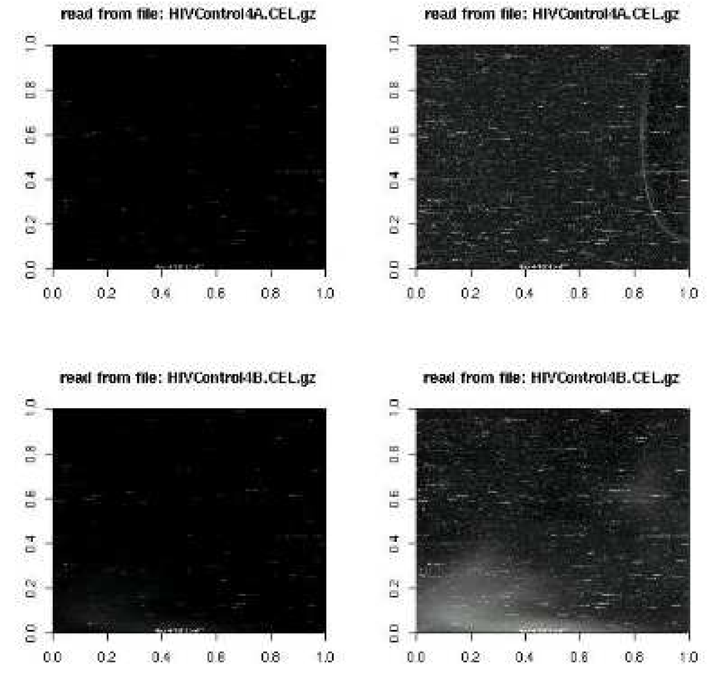

# Exploración de los datos, control de calidad y preprocesado

## Introducción

Los estudios realizados con microarrays, sea cual sea la tecnología en que se basan, tienen una característica común: generan grandes cantidades de datos a través de una serie de procesos, que hacen que su significado no siempre sea completamente intuitivo.

Como en todo tipo de análisis, antes de empezar a trabajar con los datos, debemos de asegurarnos de que éstos son fiables y completos y de que se encuentran en la escala apropiada para proporcionar la información que pretendemos obtener de ellos.

En el caso de los microarrays solemos distinguir dos fases previas al análisis de los datos:

1. __Exploración y control de calidad__ Mediante gráficos
  y/o resúmenes numéricos estudiamos la estructura de los datos
  con el fin de decidir si parecen correctos o presentan anomalías
  que deben ser corregidas.

2. __Preprocesado__ Incluso si son correctos, los datos "crudos" no sirven para el análisis sino que necesitan preprocesados, lo que puede interpretarse como uno o más de los procesos siguientes:

- "Limpiados", para eliminar la parte de la señal no atribuible a la expresión, llamada "background" o ruído.
- "Normalizados" para hacerlos comparables entre muestras y       eliminar posibles sesgos técnicos.
- Resumidos o "sumarizados" de forma que se tenga un       sólo valor por gen.
- "Transformados" de forma que la escala sea razonable y       facilite el análisis.

A menudo -por un cierto abuso de lenguaje- se denomina "normalización" al preprocesado descrito en las etapas anteriores.


### Nivel de análisis y tipo de microarray

Desde la generalización del uso de los microarrays se han
desarrollado muchas formas para visualizar los datos y decidir acerca
de su calidad. Algunas trabajan sobre los datos obtenidos del
escáner, otras lo hacen con los datos normalizados. Algunas sirven
tanto para arrays de dos colores como arrays de un color. Otras son
específicas de la tecnología. Con el fin de organizar esta
multitud de opciones podemos diferenciar:

- Datos de bajo nivel Son los datos proporcionados por el escáner contenidos por ejemplo en archivos .gpr (dos colores) o .cel (un color). Estos últimos son binarios por lo que no es posible ni tan sólo visualizarlos sin programas específicos.
- Datos de alto nivel Son los datos resultantes del (pre)procesado de los datos de bajo nivel. Básicamente se corresponden con los datos de expresión ya resumidos ("sumarizados"), normalizados o no.

La exploración y el control de calidad pueden basarse en datos de bajo o de alto nivel. En cada caso se pueden aplicar ya sean técnicas generales de visualización de datos, como histogramas, diagramas de caja o visualización en dimensiones reducidas (PCA u otras), o bien técnicas "ad-hoc" para cada tipo de datos como el MA-Plot u otras que se discuten a continuación.

### Datos de partida 

La estructura de los datos de microarrays de un color o de dos colores difiere considerablemente, tanto a nivel físico (los chips y las imágenes que de ellos se obtiene) como informático, es decir en la forma en que se representan.

#### Arrays de dos colores (o de "cDNA")

Tradicionalmente los arrays de dos colores o de cDNA se realizaban de forma menos automatizada que los de un color o de Affymetrix.
Esto implica que, tras obtener la imagen, el escaneado del archivo ".TIFF"
resultante pudiera ser llevado a cabo mediante un software independiente
como _Genepix_, un programa que convierte las imágenes en números y genera un archivo de información (con extensión ".gpr") a partir del cual pueden calcularse las expresiones relativas, así como valores de calidad para cada "spot" o punto escaneado en la imagen.

Para cada imagen (o sea para cada microarray) hay un archivo ".gpr" que contiene una fila por gen y varias columnas con distintos valores, por ejemplo:

- la intensidad para cada canal, 
- valores resumen de las intensidades y 
- resultados de controles de calidad ("FLAGS").

La tabla siguiente muestra lo que serían las primeras filas y columnas de un archivo ".gpr" obtenido mediante el programa _Genepix_.

| Gen      | Señal     | Fondo      | Señal     | Fondo      | "Flag" | Otros    |
|----------|-----------|------------|-----------|------------|-----------|----------|
|          | Cy5 (R) | Cy5 (Rb) | Cy3 (G) | Cy3 (Gb) |           |          |
| gen-1   | 3.7547   | 1.8128    | 5.0672   | 1.8496    | 1         | ... |
| gen-2   | 0.8331   | 0.9175    | 1.1536   | 0.9995    | 0         | ... |
| gen-3   | 9.8254   | 0.2781    | 0.6921   | 0.5430    | 1         | ... |
| gen-4   | 9.1539   | 0.1918    | 3.8290   | 0.0014    | 0         | ... |
| gen-5   | 4.8603   | 0.2377    | 0.5338   | 0.3335    | 0         | ... |
| gen-6   | 7.8567   | 1.3941    | 1.3050   | 1.4876    | 1         | ... |
| gen-7   | 2.7619   | 0.8108    | 8.4916   | 1.6518    | 0         | ... |
| gen-8   | 3.6618   | 0.1918    | 0.3770   | 1.1842    | 0         | ... |
| gen-9   | 4.4300   | 0.5888    | 2.8161   | 0.8707    | 1         | ... |
| ... | ...  | ...   | ...  | ...   | ...  | ... |

Los valores de intensidad se convierten en una única _matriz de expresión_ que contiene una columna por chip con los valores de intensidad relativa obtenidas por ejemplo con una "sumarización" del tipo: 
$$
\log\frac{R-Rb}{G-Gb},
$$ 
y una fila por gen (mismas filas que archivos ".gpr").

La tabla siguiente muestra lo que sería una matriz de expresión derivada de cuatro archivos ".gpr" como los de la tabla  anterior.

| gen         | Array-1   | Array-2   | Array-3    | Array-4   |
|----------|------------|------------|-------------|------------|
| gen-1   | 1.65695   | -0.10820 | 1.69515    | 8.25137   |
| gen-2   | -1.82305 | 0.11350   | 1.58807    | 0.95676   |
| gen-3   | 0.01561   | 0.47682   | -27.88036 | -1.39078 |
| gen-4   | 0.42709   | 4.29319   | -4.31366  | 30.96866  |
| gen-5   | 0.04332   | 0.24126   | -10.27675 | 0.26680   |
| gen-6   | -0.02825 | 0.68408   | 2.04163    | 0.99554   |
| gen-7   | 3.50549   | -8.04635 | 0.18286    | 0.22647   |
| gen-8   | -0.23261 | -1.08477 | 0.19582    | 1.11561   |
| gen-9   | 0.50643   | 1.52147   | 0.99092    | 0.23441   |
| ... | ...   | ...   | ...    | ...   |

#### Arrays de un color (Affymetrix)

El resultado de escanear la imagen de un array de affymetrix es un archivo de extensión ".CEL" que, a diferencia de los arrays de dos colores, está en formato binario es decir que solo puede ser leído con programas específicos para ello. 

De forma similar a los arrays de dos colores, existe un archivo ".CEL" por cada microarray.

A partir de las intensidades de los archivos ".CEL" se genera la matriz de expresión, que contiene una columna por chip con los valores de intensidad absoluta, y una fila por grupo de sondas. En el caso de arrays de affymetrix existe una gran variedad de algoritmos de "sumarización" y, según cual se utilice, se obtendrá unos u otros valores de expresión. Ahora bien, éstos serán siempre medidas absolutas, es decir independientes del resto de muestras y en una escala arbitraria.

La tabla siguiente muestra las primeras filas de una matriz de expresión sumarizada correspondiente a los primeros genes de uno de los casos resueltos.

| **ID_REF** | **GSM188013** | **GSM188014** | **GSM188016** | **GSM188018** |
|---|---|---|---|---|
| 1007_s_at | 15630.2 | 17048.8 | 13667.5 | 15138.8 |
| 1053_at | 3614.4 | 3563.22 | 2604.65 | 1945.71 |
| 117_at | 1032.67 | 1164.15 | 510.692 | 5061.2 |
| 121_at | 5917.8 | 6826.67 | 4562.44 | 5870.13 |
| 1255_g_at | 224.525 | 395.025 | 207.087 | 164.835 |
|... |... |... |... |... |

#### Datos de ejemplo 

Los ejemplos de este capítulo se basarán en dos de los conjuntos de datos descritos en el capítulo \@ref(MDAProcess).

- Por un lado, trabajaremos con los datos del conjunto \texttt{estrogen} referidos al efecto del tratamiento con estrógenos en cancer de mama descrito en \@ref{estrogen}. La exploración se basará en los datos normalizados pero también en los datos "crudos", de bajo nivel, contenidos en los archivos ".cel". Estos datos pueden obtenerse directamente del paquete de Bioconductor \texttt{estrogen}. Un aspecto interesante de este conjunto de datos es que, junto con  8 muestras "buenas" se proporciona un array defectuoso, denominado "\texttt{bad.cel}" que facilita el ver como aparecen ciertos gráficos cuando hay problemas.
- Por otro lado, usaremos los datos del conjunto \texttt{CCl4}, relativos al efecto del tratamiento con CCL4 en la expresión de los hepatocitos. Los datos resultan accesibles al instalar el paquete \texttt{CCl4}.

```{r losDatos, results='hide'}
if(!require(BiocManager)) install.packages("BiocManager")
if (!(require(CCl4))){
 BiocManager::install("CCl4")
}
if (!(require(estrogen))){
 BiocManager::install("estrogen")
}
if (!(require(affy))){
 BiocManager::install("affy")
}
if (!(require(affyPLM))){
 BiocManager::install("affyPLM")
}
```

Aunque, en la actualidad (año 2021) el paquete más utilizado para arrays de este tipo es el paquete `oligo` este ejemplo utiliza el paquete `affy`.

```{r leeDatos1colors, results='hide', echo=TRUE, message=FALSE}
library(estrogen)
library(affy)
affyPath <- system.file("extdata", package = "estrogen")
adfAffy = read.AnnotatedDataFrame("phenoData.txt", sep="",  path=affyPath)
affyTargets = pData(adfAffy)
affyTargets$filename = file.path(affyPath, row.names(affyTargets))
affyRaw <- read.affybatch(affyTargets$filename, phenoData=adfAffy)
# show(affyRaw)
actualPath <- getwd()
setwd(affyPath)
allAffyRaw <- ReadAffy()
setwd(actualPath)
```

El resultado de la lectura es un objeto "affyraw" de clase "affyBatch":

```{r, echo=TRUE}
class(affyRaw)
print(affyRaw)
```

El paquete `limma` es conocido como paquete para la selección de genes diferencialmente expresados pero también incluye algunas funciones para la lectura y preprocesado de arrays de dos colores.

```{r leeDatos2colores, results='hide', echo=TRUE, message=FALSE}
library("limma")
library("CCl4")
dataPath = system.file("extdata", package="CCl4")
adf = read.AnnotatedDataFrame("samplesInfo.txt", 
    path=dataPath)
#adf
targets = pData(adf)
targets$FileName = row.names(targets)
RG <- read.maimages(targets, path=dataPath, source="genepix")
attach(RG$targets)
newNames <-paste(substr(Cy3,1,3),substr(Cy5,1,3),substr(FileName,10,12), sep="")
colnames(RG$R)<-colnames(RG$G)<-colnames(RG$Rb)<-colnames(RG$Gb)<-rownames(RG$targets)<- newNames
# show(RG)
```

El resultado de la lectura es un objeto de classe "RGlist".

```{r}
class(RG)
print(RG)
```

## Exploración y control de calidad

Los gráficos son útiles para comprobar la calidad de los datos de microarrays,
obtener información sobre cómo se deben preprocesar los datos y comprobar, finalmente, que el preprocesado se haya realizado correctamente.

Siguiendo el esquema presentado en la tabla \@ref{tab:tablaDiagnosticos} se presentan a continuación los distintos gráficos utilizados con una breve descripción de lo que representa cada uno y como interpretarlos adecuadamente. El código para generarlos se presenta al final del capítulo como un apéndice.

### Control de calidad con gráficos estadísticos generales

#### Histogramas y gráficos de densidad

Estos gráficos permite hacerse una idea de si las distribuciones de los distintos arrays son similares en forma y posición. La figura \@ref(fig:plotAffyHist) muestra los histogramas correspondientes a los 9 arrays del conjunto de datos \texttt{estrogen}.

```{r plotAffyHist,echo=TRUE}
affySampleNames <- rownames(pData(allAffyRaw))
affyColores <- c(1,2,2,3,3,4,4,8,8)
affyLineas <- c(1,2,2,2,2,3,3,3,3)
hist(allAffyRaw, main="Signal distribution", col=affyColores, lty=affyLineas)
legend (x="topright", legend=affySampleNames , col=affyColores, lty=affyLineas, cex=0.7)
```

#### Diagramas de caja o "boxplots"

Como los histogramas los diagramas de caja --basados en los distintos cuantiles de las valores-- dan una idea de la distribución de las intensidades.  La figura \@ref(fig:plotAffyBoxplot) muestra los diagramas de caja correspondientes a los 9 arrays del conjunto de datos \texttt{estrogen}.

```{r plotAffyBoxplot}
boxplot(allAffyRaw, main="Signal distribution", col=affyColores, las=2)
```

#### Gráficos de componentes principales

El análisis de componentes principales puede servir para detectar si las muestras se agrupan de forma "natural" es decir con otras muestras provenientes del mismo grupo o si no hay correspondencia clara entre grupos experimentales y proximidad en este gráfico. Cuando esto sucede no significa necesariamente que haya un problema pero puede ser indicativo de efectos técnicos -como el conocido efecto "batch"- que podría ser necesario corregir.

```{r plotPCAdef, results='hide'}
plotPCA <- function ( X, labels=NULL, colors=NULL, dataDesc="", scale=FALSE)
{
  pcX<-prcomp(t(X), scale=scale) # o prcomp(t(X))
  loads<- round(pcX$sdev^2/sum(pcX$sdev^2)*100,1)
  xlab<-c(paste("PC1",loads[1],"%"))
  ylab<-c(paste("PC2",loads[2],"%"))
  if (is.null(colors)) colors=1
  plot(pcX$x[,1:2],xlab=xlab,ylab=ylab, col=colors, 
       xlim=c(min(pcX$x[,1])-10, max(pcX$x[,1])+10),
       ylim=c(min(pcX$x[,2])-10, max(pcX$x[,2])+10),
       )
  text(pcX$x[,1],pcX$x[,2], labels, pos=3, cex=0.8)
  title(paste("Plot of first 2 PCs for expressions in", dataDesc, sep=" "), cex=0.8)
}
``` 

```{r tempNorm, echo= TRUE, results='hide'}
if (!file.exists("datos/affyNorm")){
  allAffyNorm<- rma(allAffyRaw)
  affyNorm <- rma(affyRaw)
  save(allAffyNorm, affyNorm, file="datos/affyNorm.Rda")
}else{
  load(file="datos/affyNorm.Rda")
}
``` 

La figura  \@ref(fig:plotPCA2D) muestra dos diagramas de compnentes principales realizados a partir de los datos normalizados del conjunto de datos \texttt{estrogen}. El gráfico de la parte superior que incluye el array defectuoso ilustra que la principal fuente de variabilidad es la diferencia de este array con el resto. Cuando se repite el análisis omitiendo esta muestra puede verse como la principal fuente de variación (eje X) se asocia con el tiempo de exposición (alto a la derecha, bajo (10h) a la izquierda, mientras que la segunda fuente de variación se asocia con la exposición a los estrógenos (alto arriba, bajo abajo).

El gráfico de la parte inferior en el que este array se ha eliminado antes de calcular las componentes principales muestra dos agrupaciones claras de arrays "derecha e izquierda" y "arriba y abajo" de la figura. El hecho de que los grupos no se correspondan con los tratamientos sugiere que puede haber alguna fuente adicional de variación que ha de tenerse en cuenta.

```{r plotPCA2D, echo=TRUE}
opt <- par(mfrow=c(2,1))
plotPCA(exprs(allAffyNorm), labels=affySampleNames, dataDesc="PCA for all arrays\nincludes defective sample")
plotPCA(exprs(affyNorm), labels=colnames(exprs(affyNorm)), dataDesc="PCA for all arrays")
par(opt)
```

#### Imagen del chip

Otra forma de ver si las muestras se agrupan según los grupos experimentales, o mediante otros criterios es usando un cluster jerárquico que realiza una agrupación básica de las muestras por grado de similaridad según la distancia que se utilice.

Como en el caso de las componentes principales si las muestras se agrupan según las condiciones experimentales es una buena señal pero si no es así puede deberse a la presencia de otra fuente de variación o bien al hecho de que se trata de un gráfico basado en todo los datos y las condiciones experimentales pueden haber afectado un pequeño número de genes.

La figura \@ref(fig:plotDendro) muestra como se agrupan los datos del conjunto \texttt{estrogen} en base a un cluster jerárquico. Como en el caso de las componentes principales tras eliminar el array defectuoso las muestras se separan, primero por el tiempo de exposición y luego por niveles de estrógeno suministrado.

```{r plotDendro, echo=TRUE, fig.cap="Un cluster jerárquico sirve para determinar si las muestras se agrupan de forma natural según los grupos experimentales o si lo hacen de otra forma"}
clust.euclid.average <- hclust(dist(t(exprs(affyNorm))),method="average")
plot(clust.euclid.average, labels=colnames(exprs(affyNorm)), main="Hierarchical clustering of samples",  hang=-1, cex=0.7)
```

### Gráficos de diagnóstico para microarrays de dos colores

El diagnóstico de arrays de dos canales se basa principalmente
en la imagen y en diferentes tipos de gráficos.

#### Diagramas de dispersión y "MA-plots"

La normalización discutida en este mismo capítulo es un punto
clave en el proceso de análisis de microarrays y se ha dedicado un
gran esfuerzo a desarrollar y probar diferentes métodos
(@Quackenbush:2003,@Yang:2002a). Una razón para ello es que
hay diferentes artefactos técnicos que deben ser corregidos para
poder ser utilizados, y no cualquier método puede funcionar con
todos ellos.

En general, los métodos de normalización se basan en el siguiente
principio: \emph{La mayor parte de los genes en un array se pueden expresar
o no expresar ante cualquier condición, pero se espera que sólo
una pequeña cantidad de genes muestre cambios de expresión entre
condiciones}.

Esto da una idea de como debería ser un gráfico de
intensidades. Por ejemplo, si no hubiese artefactos técnicos, en
arrays de dos canales, una gráfica de dispersión de intensidad del
rojo frente al verde debería dejar la mayor parte de los puntos
alrededor de una diagonal. Cualquier desviación de esta situación
debería ser atribuible a razones técnicas, no biológicas, y por
tanto, debería ser eliminada. Esto ha conducido a un método de
normalización muy popular consistente en estimar la transformación
a aplicar, como una función de las intensidades utilizando el
método \emph{lowess} en la representación transformada de la
gráfica de dispersión conocida como el \emph{gráfico MA--plot}.

La figura \@ref(fig:c05normScatterMA) muestra, en su parte izquierda (a) un gráfico de dispersión del canal
rojo frente al verde en un array de dos colores. El hecho de que los
datos no estén centrados alrededor de la diagonal sugiere la necesidad de
normalización. 

Una representación muy popular que ayuda a visualizar mejor esta
asimetría es lo que se conoce como  "\emph{MA-plot}", que aparece en la parte derecha (b) de la figura\@ref(fig:c05normScatterMA). Geométricamente representa una rotación del gráfico de dispersión, en la que el significado de los nuevos ejes es:

- $A=\displaystyle \frac{1}{2}(\log_2 (R*G))$: El logaritmo de la
  intensidad media de los dos canales,
- $M=\log_2 \displaystyle \frac{R}{G}$: El logaritmo de la expresión relativa entre
ambos canales (normalmente conocido como "log--ratio").

```{r c05normScatterMA, fig.cap="(a) Gráfico de  un canal frente al otro  (b) MA-plot (intensidad frente log-ratio)", echo=FALSE}
knitr::include_graphics("figures/c05normScatterMA.png")
```

#### Imagen del array

La imagen del chip (véase la figura \@ref(c05signalNoise),
izquierda) ofrece una visión rápida de la calidad del array,
proporcionando información acerca del balance del color, la
uniformidad en la hibridación y en los \emph{spots}, de si el
background es mayor del normal y dela existencia de artefactos como el
polvo o pequeñas marcas (rasguños).

#### Histogramas de señales y de la relación señal--ruído

Estos gráficos (véase la figura \@ref(fig:c05signalNoise), derecha) son útiles para detectar posibles anormalidades o un background excesivamente alto .

```{r c05signalNoise, fig.cap="La relación señal ruido sirve para detectar posibles anormalidades o un background excesivamente alto como medida de calidad", echo=FALSE}
knitr::include_graphics("figures/c05signalNoise.png")
```

#### Boxplots

Un gráfico muy utilizado es el diagrama de cajas o "boxplot"
múltiple con una caja por cada chip. Del alineamiento (o falta de
él) y la semejanza (o disparidad) entre las cajas, se deduce si hace
falta, o no, normalizar entre arrays.

En el caso de arrays de dos colores pueden utilizarse diagrams de
cajas "dentro de arrays" (entre distintos sectores del mismo chip) y
"entre arrays".

### Gráficos de diagnóstico para microarrays de un color

#### Imagen del chip

Los arrays de affymetrix contienen millones de sondas por lo que no pueden examinarse a simple vista. A pesar de ello hay diversas formas de obtener una imagen que, en caso de presentar irregularidades pueden indicar algún tipo de problemas como burbujas, arañazos, etc. La figura \@ref(c06plotAffy} muestra algunas de las imágenes 

La imagen del array de Affymetrix sólo es útil para evidenciar grandes problemas como burbujas, arañazos, etc. En este ejemplo los dos arrays de la izquierda se considerarían aceptables y los de la derecha defectuosos.


```{r c05plotAffy, fig.cap="Imágenes de cuatro microarrays de Affymetrix", echo=FALSE}

```

#### Gráfico "M-A"

En los chips de dos colores el MA--plot se utliza para comparar los dos canales en cada array (rojo y verde). En cambio, en los chips de Affymetrics, en que sólo hay un canal en cada array,  la única forma de definir M (el log ratio) es a partir de la comparación  entre pares de de valores, ya sea los arrays dos a dos o bien cada array respecto un valor de referencia que puede ser la mediana, punto a punto, de todos los arrays (véase por ejemplo la figure \ref{c05MAPlotAffy}).

```{r c05MAPlotAffy, fig.cap="En los chips de Affymetrix la única forma de definir M (el log ratio) es comparar entre diferentes arrays", echo=FALSE}
knitr::include_graphics("figures/c05MAPlotAffy.png")
```

$M=\log_2(I_1) - \log_2(I_2)$: log ratio
$A=\displaystyle \frac{1}{2}(\log_2 (I_1)+\log_2(I_2))$: log de intensidades
Donde $I_1$ es la intensidad del array de estudio, e $I_2$ es la intensidad media de arrays.
Por lo general, se espera que la distribución en el gráfico se concentre a lo largo del eje M = 0.

#### Modelos de bajo nivel ("Probe-Level-Models" o PLM)

Los modelos de bajo nivel ("Probe-Level-Models" o PLM) ajustan a los valores de intensidad --a nivel de sondas, no de valores totalizados de gen-- un modelo explicativo. Los valores estimados por este modelo se comparan con los valores reales y se obtienen los errores o "residuos" del ajuste. El análisis de dichos residuos procede de forma similar a lo que se realiza al analizar un modelo de regresión:
Si los errores no presentan ningún patrón especial supondremos que el modelo se ajusta relativamente bien.
Si, en cambio, observamos desviaciones de esta presunta aleatoriedad querrá decir que el modelo no explica bien las observaciones, lo cual se atribuirá a la existencia de algún problema con los datos.

Con los valores ajustados del modelo se calculan dos medidas:

- La expresión relativa en escala logarítmica " Relative Log Expression" (RLE) es una medida estandarizada de la expresión.
No es de gran utilidad pero debería presentar una distribución similar en todos los arrays.
- El error no estandarizado y normalizado o "NUSE" es el más informativo ya que representa la distribucián de los residuos a la que
hacíamos referencia más arriba.
Si un array es problemático la caja correspondiente en el boxplot aparece desplazada hacia arriba o abajo de las demás.

```{r affyPLM, echo=TRUE, results='hide'}
stopifnot(require(affyPLM))
Pset<- fitPLM(allAffyRaw)
```

La figura \@ref(c06plotAffy5) muestra los gráficos RLE y NUSE para el conjunto de datos estrogen. En ambos gráficos puede verse como el array defectuoso "\texttt{bad.cel}" queda claramente diferenciado del resto.

```{r plotPLM ,fig.cap ="Graficos de diagnóstico calculados a nivel de sondas PLM", echo=TRUE}
opt<- par(mfrow=c(2,1))
RLE(Pset, main = "Relative Log Expression (RLE)", 
    names=rownames(pData(allAffyRaw)), las=2, cex.axis=0.6)
NUSE(Pset, main = "Normalized Unscaled Standard Errors (NUSE)", las=2, 
     names=rownames(pData(allAffyRaw)), las=2, cex.axis=0.6)
par(opt)
```

## Normalización de arrays de dos colores

La palabra \emph{normalización} describe las técnicas utilizadas para transformar adecuadamente los datos antes de que sean analizados.
El objetivo es corregir diferencias sistemáticas entre muestras, en la misma o entre imágenes, lo que no representa
una verdadera variación entre las muestras biológicas.

Estas  diferencias sistemáticas pueden deberse, entre otras, a:

 - Cambios en la tinción que producen sesgos  la intensidad del \emph{spot}.
- La ubicación en el array que puede afectar el proceso de lectura.
- Un problem en la placa de origen.
- La existencia de diferencias en la calidad de la impresión: pueden presentarse  variaciones en  los pins y el tiempo de impresión
- Camio en los parámetros de la digitalización (escaneo).

A veces puede ser difícil detectar estos problemas , aunque existen algunas  formas de saber  si es necesaria realizar una normalización. Aqui destacamos dos posibilidades:

1. Realizar una auto-hibridación.  Si hibridamos una muestra con
  ella misma, las intensidades deberían ser las mismas en ambos
  canales.  Cualquier desviación de esta igualdad, significa que hay
  un sesgo sistemático.
2. Detectar artefactos espaciales en la imagen o en la tinción de
  los gráficos de diagnóstico

### Normalización global

Este método esta basado en un ajuste global, es decir en modificar todos los valores una cantidad \emph{c}, estimada de acuerdo a algún criterio.
\begin{equation}
 \log_2 R/G \rightarrow \log_2 R/G-c=\log_2 R/(Gk)
\end{equation}
opciones para $k$ o $c= \log_2k$ son

$c$= mediana o media de log ratio para un conjunto concreto de genes o genes control o genes housekeeping.

La intensidad total de la normalización

$k=\sum R_i/\sum G_i$

### Normalización dependiente de la intensidad
En este caso se realiza una modificación específica para cada valor. Esta modificación se obtiene como una función de la intensidad total del gen ($c=c(A)$).
\begin{equation}
 \log_2 R/G \rightarrow \log_2 R/G-c(A)=\log_2 R/(Gk(A))
\end{equation}

Una posible estimación de esta función puede hacerse utilizando la función \emph{lowess} (LOcally WEighted  Scatterplot Smoothing).

## Resumen y normalización de microarrays de Affymetrix

En los arrays de Affymetrix, como en todos los tipos de microarrays, tras escanear la imagen se obtiene una serie de valores de
intensidad de cada elemento del chip.
En el caso de estos arrays sabemos que cada valor no corresponde a la expresión de un gen:


- Hay múltiples valores (sondas o "probes") por cada gen, que originan un \emph{probeset}.
- Cada grupo de sondas  consiste en múltiples pares de sondas, donde cada puede tener  dos elementos:
\subitem Un "perfect match" que coincide exactamente con el fragmento del gen al que corresponde la sonda
\subitem Un "mismatch" que que coincide con el anterior salvo por el valor central que se ha sustituído por el nucleótido complementario.
Estos "mismatches' se introdujeron en los primeros arrays de affymetrix para tener una medida de hibridación no específica pero en las versiones más recientes se han abandonado.

El proceso que convierte las señales individuales en valores de expresión normalizados para cada gen consta de tres etapas:

1. Corrección del ruido de fondo o "background"
2. Normalización para hacer los valores comparables
3. "Sumarización"(Resumen) o concentración de los valores de cada grupo de sondas en un único valor de expresión absoluto normalizado
para cada gen.

A menudo los tres pasos se denominan genérica -y erróneamente- "normalización".

A diferencia de los chips de ADNc, aquí las medidas de expresión son absolutas (no se compara una condición contra otra)
dado que cada chip se hibrida con un única muestra.

Hay muchos métodos para estimar la expresión (más de 30 publicados).
Cada método contempla de forma explícita o implícita las tres formas de preprocesado: corrección del fondo,
normalización y resumen.

Los principales métodos que consideraremos son:

- Microarray Suite (MAS). Método oficial de Affymetrix. Versiones 4.0 y 5.0
- dChip: Li and Wong. Método basado en modelos multichip.
- RMA (Bioconductor). Actualmente es el método "estándar".


### Métodos originales de Affymetrix 
#### M.A.S. 4.0

Es el primer método introducida por Affymetrix.
La corrección del fondo se realiza restando el "perfect match" del "mismatch"
\begin{equation}
 E_j=PM_j-MM_j
\end{equation}
La normalización se realiza de forma global haciendo transformaciones de forma que la media de todo el chip sea la misma y
la sumarización se basa en calcular el promedio de las diferencias absolutas ignorando los pares que se desvían más de $3\sigma$ de $\mu$.
\begin{equation}
 Dif. Media=\frac{1}{|A|}\sum_{j \in A}(PM_j-MM_j)
\end{equation}
Los problemas que presenta estemétodo son:

- 1/3 de los MM son mayores que los PM
- Pueden aparecer valores MM negativos
- El uso de los MM añade ruido


#### M.A.S. 5.0

Los problemas que presentaba el método M.A.S. 4.0 llevaron a
sustituirlo por otra variante, el M.A.S 5.0, llamado así por venir
implementado en el software de affymetrix llamado "MicroArray Suite
5.0".

Este método utiliza un estadístico robusto, \emph{el biweight de
  Tukey}, para corregir y ponderar el fondo y calcular (estimar) la
señal.  El biweight de Tukey $T_{bi}$ pondera los valores por su
distancia a la mediana, es decir, mide la tendencia central pero
realiza un ajuste de outliers.

La lógica de este método reside en pensar que el valor de MM no siempre tiene sentido, (p.ej si MM $>$ PM).
Dado que esto sucede en ocasiones se realiza el cambio siguiente:

1. Se introduce el background específico de un conjunto de pruebas $i$ de tamaño $n$ basado en los pares de pruebas $j$:
\begin{equation}
 SB_i=T_{bi}(\log(PM_{i,j})-\log(MM_{i,j})): j= 1,\ldots,n
\end{equation}
2. SB se utiliza para decidir como se ajusta el background

- Si es grande los datos suelen ser fiables
- Si es pequeño mejor basarse tan solo en PM

Este método no tan solo corrige el background sino que también permite normalizar y sumarizar.
Para ello se introduce el "Mismatch Idealizado" (IM) que permite corregir la intensidad de las pruebas individuales.
Este método también ha sido muy criticado:

- Se considera que no tiene mucho sentido promediar las pruebas entre arrays, pues éstos pueden tener características
de hibridación intrínsecamente distintas.
- El método no mejora "aprendiendo" del funcionamiento entre arrays de las pruebas individuales.

### El método RMA (Robust Multi-Array Average)

Para compensar algunas deficiencias de los primeros métodos de
resumen y normalización de arrays de Affymetrix, Irizarry y sus
colegas introdujeron en 2003 (~\cite{Irizarry:2003}) un método basado en la modelización de las intensidades de las sondas que, en vez de basarse en las distintas sondas de un gen dentro de un mismo array se basa en los distintos valores de la misma sonda entre todos los arrays disponibles,

Esquemáticamente los pasos que realiza este método son:

1. Ajusta el ruído de fondo (background) basándose solo en los
  valores PM y utilizando un modelo estadístico complejo en el que
  combina la modelización de la señal mediante una distribución exponencial con la del ruído mediante una distribución normal.
2. Toma logaritmos base 2 de cada intensidad ajustada por el background.
3. Realiza una \emph{normalización por cuantiles} de los valores del paso 2 consistente en substituir cada valor individual por el que tendría la misma posición en la distribución empírica estimada sobre todas las muestras, es decir los promedios de las distribuciones de los valores ordenados de cada array (véase figura \ref{c06quantilNorm})
4. Estima las intensidades de cada gen separadamente para cada conjunto de sondas. Para ello realiza una técnica similar
a una regresión robusta denominada "pulido de medianas" (median polish) sobre una matriz de datos que tiene los arrays en filas y los grupos
de sondas en columnas.

Como resultado final de todos los pasos anteriores se obtiene la matriz con los  datos sumarizados y normalizados. A pesar de no estar exento de críticas como la que afirma que este procedimiento "compacta" los valores reduciendo su variabilidad natural, este método se ha convertido en el estándar "de facto" actualmente por  muchos usuarios de Bioconductor.

```{r c06quantilNorm, fig.cap="El método RMA incluye una normalización por cuantiles como la representada esquemáticamente en esta figura", echo=FALSE}
knitr::include_graphics("figures/c06quantilNorm.png")
```

## Filtraje no específico

El filtraje no específico es recomendable para eliminar el ruido de fondo y limitar los ajustes posteriores a los necesarios.
Los principales procesos de filtrado son:

 - Eliminanción de los spots marcados como erróneos mediante  flags y que son debidos  a problemas en la hibridación o en el escaneo.
 - Eliminanción de spots con señales muy bajas debido a problemas en el \emph{spotting} o a que no ha habido hibridación en ese spot (Filtraje pr ).
- Eliminación de genes que no presenten una variación significativa en su señal, entre distintas condiciones experimentales (Filtraje por variabilidad).
Ante la duda,\emph{se debe ser conservador y reducir la operación de filtraje al mínimo}

El objetivo del filtraje es eliminar aquellos spots cuyas imágenes o señales sean erróneas por diferentes motivos, disminuyendo el ruido
de fondo. Aunque existe controversia a su uso, prefiriendo el no filtrado a eliminar de forma no intencionado spots informativos.


