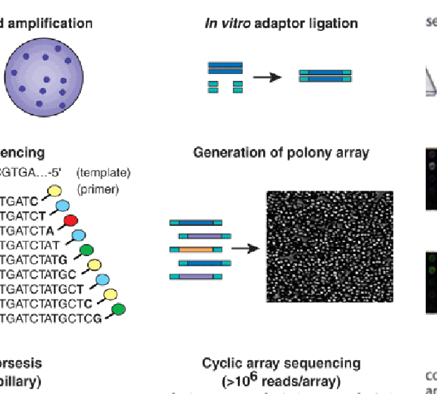
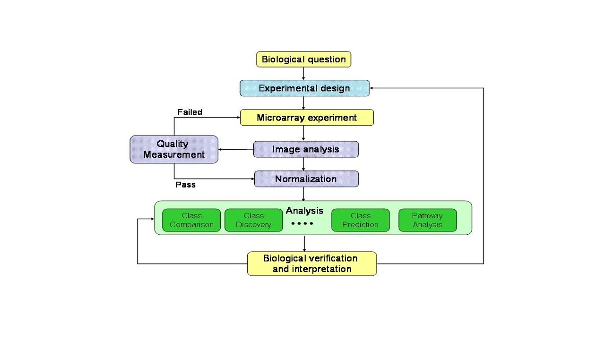
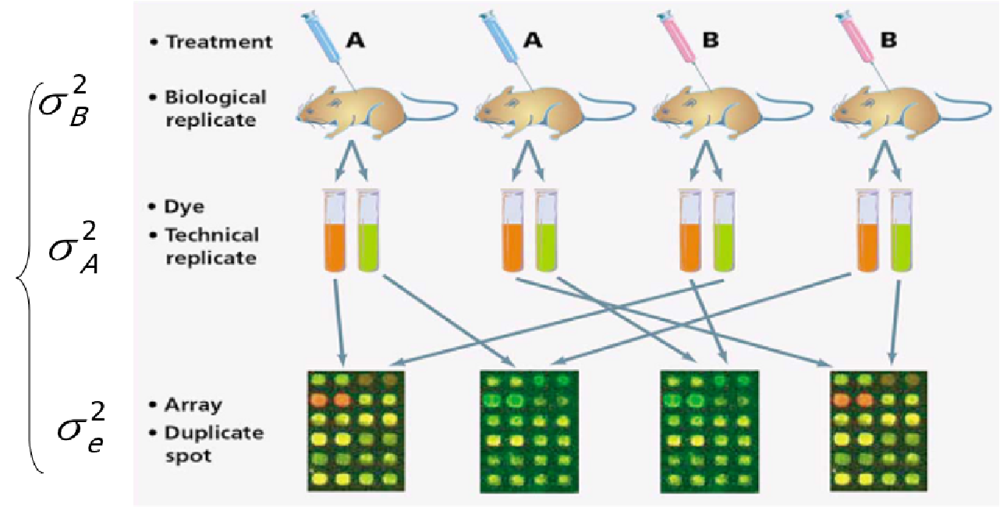

# Presentación

Este documento es una versión actualizada -en varios sentidos- de unos materiales de análisis de microparrays que escribimos allá por 2010, usando LateX y Sweave, junto con la profesora M. Carme Ruíz de Villa para la asignatura "Análisis de Microarrays" del posgrado de Bioinformática de la Universitat Oberta de Catalunya .

En estos años han cambiado muchas cosas. El posgrado es ahora un máster interuniversitario entre la UOC y la Universidad de Barcelona (UB). Muchos estadísticos i/o bioinformáticos -entre los que me incluyo- han cambiado de Latex/Sweave a RStudio/RMarkdown y Github. Mi compañera de escritura, Mamen, se ha jubilado, pero un nuevo compañero, Ricardo, se ha apuntado a la aventura de revivir estos materiales. Y aunque sigue sin estar claro si los micrarrays también se jubilaran pronto, el campo de las ómicas ha crecido de forma explosiva. El "Análisis de datos ómicos", título de este nuevo documento ya no se centra en los microarrays. También trata de RNA-seq, Proteómica, Metagenómica, Metabolómica o Epigenómica por citar sólo algunos de los más populares.

Es obvio que un curso de "Análisis de datos ómicos" no puede abarcar todas estas disciplinas, aunque también lo es que comparten muchos elementos comunes.

El plan de desarrollo para esta nueva edición, que podra seguirse en el repositorio de Github (), tendrá dos fases:

1. En una primera, actualizaremos la versión original a RMarkdown, eliminando aspectos desfasados y actualizando el código R a la version actual de R/Bioconductor.
2. En una posteriora miraré de añadir capítulos que introduczcan nuevas tecnologías y muestren como analizar los datos que estas generan. Si logro engañar a algunos colegas para que escriban un capítulo también los añadiré a los autores.

Previsiblemente este documento, con sus errores e imperfecciones se quedará como "open source" para uso de quien lo desee sin tener que pasar por el doloroso y anquilosante proceso de convertirlo en un libro, que, en este caso, empezaría a quedar obsoleto al minuto de estar acabado.

<!--chapter:end:index.Rmd-->

# Introducción a los microarrays y otras tecnologías ómicas

## Antecedentes históricos

La biología molecular ha estado interesada desde sus comienzos en poder determinar
 el nivel de expresión de los genes integrados en el genoma humano. Para ello dispone desde hace años de múltiples técnicas para medir estos niveles, tales como el<tt> Northern blot</tt> (a nivel de ARN) o el <tt>Western blot</tt> (a nivel de proteína).

Especial interés ha tenido siempre sobre las otras biomoléculas el estudio de los niveles del ARN transcrito. Hace unos años se
acuñó el término de _transcriptómica_ para referirse al estudio del ARN en cada una de sus formas.
La transcriptómica ha contribuído a tener una mejor comprensión de la patogénesis de las enfermedades.
En el año 2009 Wang y colaboradores (@Wang:2009) definieron el transcriptoma como el conjunto completo de tránscritos en una
célula y su cantidad en un momento determinado  del desarrollo o en una determinada condición fisiológica. \textB{El transcriptoma}{el conjunto completo de tránscritos en una
célula y su cantidad en un momento determinado  del desarrollo o en una determinada condición fisiológica}
Como objetivos de la transcriptómica se han definido tres principales:

1. Catalogar todas las especies de tránscritos, incluyendo ARNm, ARN no codificante y pequeños ARNs.

1. Determinar la estructura transcripcional de los genes, en términos de sus puntos 5' de inicio y 3' de finalización,
las modificaciones post-transcripcionales y los patrones de splicing.

1. Cuantificar los diferentes niveles de expresión de cada tránscrito durante el desarrollo y bajo diferentes condiciones.

El interés de la transcriptómica no solamente se ha centrado en el desarrollo de nuevas tecnologías que mejoran su estudio,
sino también en el desarrollo de nuevos métodos de extraer la gran cantidad de información que se genera con estas nuevas técnicas.


## Los microarrays

Una de las técnicas que revolucionó el estudio del transcriptoma fueron los microarrays.
Un microarray es un artefacto para la realización de experimentos que permite estudiar simultáneamente múltiples unidades,
b que representan los genes, proteínas o metabolitos, sobre un sustrato sólido de cristal,
plástico o sílice, y expuestos a la acción de las moléculas diana cuya expresión se desea analizar (ver Figura \@ref(fig:c01microarray).


```{r c01microarray, fig.cap="Imagen de un microarray", echo=FALSE}
knitr::include_graphics("epsimages/c01microarray.png")
```


La utilización de los microarrays en la última década ha generado inmensas cantidades de datos útiles para el estudio y el desarrollo de enfermedades,
dando a conocer múltiples mapas de expresión génica, encontrar biomarcadores o construir firmas génicas para determinadas enfermedades.

Lo que caracteriza a los nuevos métodos utilizados para estudiar el transcriptoma no es lo que pueden medir, sino la cantidad de mediciones
simultáneas que pueden realizar.  Mientras que hasta hace apenas una década se estudiaban los genes uno a uno en profundidad, a partir del uso de estas nuevas tecnologías se
pueden estudiar muchísimos genes a la vez, pero en contrapartida con mucho menos detalle y más ruído.

Los microarrays, hoy una metodología bien consolidada, han sido cruciales para concebir una nueva manera de estudiar el transcriptoma, especialmente en el campo de la expresión génica. Después de ellos han venido otras técnicas que tienen en común con ellos el \"alto rendimiento\" es decir la capacidad para medir muchas variables --cientos o miles-- a la vez. Entre estas técnicas podemos destacar los arrays de SNPs, los microRNAs, la metilación y especialmente la secuenciación de nueva generación.


### Aplicaciones de los microarrays

La tecnología de los microarrays se ha aplicado a una inmensa variedad de problemas, desde el estudio de enfermedades como el cáncer o la
esclerosis múltiple al de los ritmos circadianos de las frutas.
Entre otros temas los microarrays se han aplicado a:

* Estudio de genes que se expresan diferencialmente entre varias condiciones (sanos vs enfermos, mutantes vs salvajes, tratados vs no tratados) (@Callow:2000, Hedenfalk:2002,Kupin:2006).
* Clasificación mólecular en enfermedades complejas (@Golub:1999, Barrier:2005).
* Identificación de genes caracerísticos de una patología (firma o \"signature\") (@dyrskjot:2002).
* Predicción de respuesta a un tratamiento (@Lin2006).
* y una gran variedad de otros temas


## Cómo funcionan los microarrays

En términos generales los microarrays funcionan mediante la hibridación de una sonda específica (\"probe\") y una molécula diana (\"target\").
La hibridación que ha tenido lugar se detecta mediante fluorescencia y se visualiza con la ayuda de un escáner. Los niveles de fluorescencia
detectados reflejan la cantidad de moléculas diana presentes en la muestra problema.

Existen diferentes tipos de microarrays según la naturaleza del \"target\" que se está estudiando. Podemos encontrar microarrays de protéinas,
de tejidos, de ADN o de ARN (también llamados de expresión). En este curso nos centraremos en los microarrays de expresión génica aunque
al final del capítulo se hace mención de algunos de los otros tipos de microarrays que existen.

Una clasificación habitual de los microarrays es por el número de muestras que se hibridan simultáneamente. Distinguimos:

1. Microarrays de dos colores o \"spotted arrays\"
2. Microarrays de un color o arrays de oligonucleótidos.


### Microarrays de dos colores

Estos arrays aparecieron a mediados de los años 90 (@Schena:1999)
y están basados en la _hibridación competitiva_ de dos muestras, cada una de las cuales ha sido marcada con un marcador fluorescente
diferente (normalmente Cy3 y Cy5, verde y rojo respectivamente).

En el array se imprimen las sondas (üna sonda$\simeq$ un gen\") cuyas secuencias se obtienen de información almacenada en bases de datos de secuencias como  <tt>GenBank</tt>, <tt>dbEST</tt>, etc.


```{r c01microarray2col, fig.cap="En los microrrays de dos colores las sondas son sintetizadas _in vitro_ y depositadas directamente sobre una superficie de cristal", echo=FALSE}
knitr::include_graphics("epsimages/c01microarray2col.png")
```


El ARN de las muestras problemas es extraído y posteriormente marcado con los
 marcadores fluorescentes, según a que grupo a comparar pertenezcan.
Las muestras marcadas se mezclan y se hibridan sobre el array.
La hibridación consiste en combinar la muestra (target) y el microarray (sondas) y dejarlos un tiempo en una cámara de hibridación a
una temperatura y agitación determinadas.
Las sondas que tengan secuencias complementarias en las muestras, se hibridarán con ellas y quedaran fuertemente adheridas.
Pasadas unas horas se lava el microarray para eliminar los \"targets\" que no se hayan hibridado. Después de la hibridación el array se ilumina con un láser que provoca que el marcador fluorescente emita fluorescencia de uno u
otro color generando dos imágenes que se superpondrán para su análisis conjunto.
La cantidad de fluorescencia generada es proporcional a la cantidad de ARNm presente en la muestra problema. El resultado final es un valor que
representa el nivel de expresión de una muestra respecto a la otra por lo que se le denomina expresión _ relativa_.

### Microarrays de un color 

Como su propio nombre indica, en estos arrays las muestras están marcadas únicamente con un marcador fluorescente.
En cada array solamente se hibrida una muestra, por lo que no se da la hibridación competitiva como pasaba en los arrays de dos colores.
El valor que se obtiene después de iluminar el array con el láser es una medida numérica que se obtiene directamente del escaner, es decir no está referida al valor de otra muestra por lo que recibe el nombre de expresión _absoluta_.


#### Fabricación de los arrays de oligonucleótidos

La empresa Affymetrix (Santa Clara, California) es la casa comercial líder en la manufacturación y venta de este tipo de microarrays.
Affymetrix sintetiza las sondas directamente sobre el chip mediante un proceso llamado fotolitografía.
Este proceso consiste en la adición cíclica de los cuatro nucleótidos (adenina, timina, citosina y guanina)
sobre la superficie rígida, donde existen ancladas unas especies químicas reactivas que se protegen y desprotegen para añadir el
nucleótido deseado, mediante ciclos de luz y oscuridad. Así se consigue la síntesis de oligonucleótidos de unos 25-mer (\"mer\"=bases) de longitud.
En la figura  @ref(fig:c01affymetryxsynthesis)
se esquematiza el proceso.


```{r , fig.cap="Esquema del proceso de fabricación de arrays de oligonucleótidos", echo=FALSE}
knitr::include_graphics("epsimages/c01affymetryxsynthesis.png")
```

Cada oligonucleótido sintetizado de 25-mer (es decir 25 bases) se denomina sonda (\"probe\"). Alrededor de 40x107 de estas sondas se agrupan en una celda llamada \"probe cell\".
Las \"probe cell\" estan organizadas en parejas, \"probe pairs\", donde se
combinan un \"Perfect Match\" (PM) -cuya secuencia de 25-mer coincide perfectamente con una parte del gen-y un \"Mismatch\" (MM)
-idéntico al PM, escepto en el nucléotido central que no coincide (ver la figura <a href="`{r anchorLoc('c01affy-PM-MM')`">here</a>)

De 11 a 20 \"probe pairs\" se agrupan para formar un \"probe set\".
Diferentes \"probe sets\" se distribuyen a lo largo del array, y son las que definen a qué gen se unen y las que definen los niveles de
expresión detectados.

El Mismatch (MM) se creo originalmente para que proporcionara una medida de la unión inespecífica (es decir lo que se hibridara con esta secuencia \"parecida\" pero distinta a la original se consideraría ruído). Aunque algunos algoritmos originales de Affymetrix todavía lo utilizan, hoy en día ha caído en desuso, muchos algoritmos modernos como RMA --que se explicará más adelnat-- ya no lo utilizan y en las nuevas versiones de los arrays (mudelos \"Hugene\" por ejemplo) ya no se incluyó.


```{r c01affy-PM-MM, fig.cap="Estructura de un grupo de sondas (`probe sets`) de un array antiguo de Affymetrix en el que se muestra los distintos términos definidos: `probe-set`, `probe-pair`, `Perfect-Match`, `Mismatch`", echo=FALSE}

knitr::include_graphics("epsimages/c01affy-PM-MM.png")
```


### Realización de un experimento de microarrays

Tanto en los arrays de un color como en los de dos colores
el material de partida es el ARN. Es muy importante controlar la calidad y la cantidad del ARN, ya que puede influir directamente en la calidad final de los resultados. Para ello se utiliza  un equipo llamado \"Bioanalyzer\" (Agilent Technologies, Santa Clara, California) que proporciona entre otros parámetros un valor llamado \"RNA Integrity Number (``RIN\")'' que sirve para decidir si la calidad del ARN es suficientemente buena como para que valga la pena usarlo para hibridar un microarray. Este valor varia entre 0 y 10 y en general suele exigirse un valor mínimo de por ejemplo 7 u 8.

Una vez decicido que la calidad del ARN de la muestra es aceptable la cantidad inicial de ARN es amplificada unas 25 veces utilizando enzimas y cebadores específicos.

Posteriormente el ARN es marcado con una
molécula fluorescente (ficoeritrina en este caso) y fragmentado en trozos más pequeños que se puedan unir a las \"probes\" fijadas en el array,
mediante el proceso de hibridación. Al igual que en los arrays de dos colores, el array hibridado es iluminado en un escáner mediante un láser,
para que la ficoeritrina emita luz fluorescente. La fluorescencia registrada de cada \"probe set\", es directamente proporcional a la cantidad de ARN presente en la muestra inicial de cada gen. La figura <a href="`{r anchorLoc('01affymetrixMicroArrays')`">here</a> es una representación esquemática del uso de microarrays de un color.

```{r c01affymetrixMicroArrays, fig.cap="Esquema del funcionamiento de un microarrays de Affymetrix o de un sólo color", echo=FALSE}

knitr::include_graphics("epsimages/c01affymetrixMicroArrays.png")
```

### Como se mide la expresión

Los microarrays permiten cuantificar la expresión de los genes a través de la
intensidad de la fluorescencia que es capturada por los escáneres. Las imágenes
se convierten en valores por un proceso que no es objeto de discusión en este
curso, pero que puede ser considerado relativamente fiable y estable (véase, por ejemplo @Schena:1999).

Cada tecnología genera diferentes tipos de imágenes y éstas generan diferentes valores que deben ser tratados adecuadamente para proporcionar
alguna clase de estimaciones de una misma variable: la _expresión génica_.

Tal como se ha indicado anteriormente una de las principales diferencias entre arrays de uno y dos colores es que estos últimos se basan en la _hibridación competitiva_  de las dos muestras mientras que los de un color sólo miden cuanta muestra se hibrida con las sondas del chip. En consecuencia en los arrays de dos colores se mide _cuánto se expresa un gen en una muestra respecto a la otra_ lo que tiene un sentido biológico en términos de \"sobre--expresión\" (por ejemplo, si un gen se expresa dos veces más en una condición que en la otra puede deducirse que está activado o sobre--expresado) o \"sub--regulación\" (si el gen se expresa la mitad en una condición que en otra puede deucirse que está inhibido o regulado negativamente). En los arrays de un color en cambio tan s'olo se mide  _cuánto se expresa un gen_ en una escala que carece de sentido biológico.


#### Medición de la expresión relativa en arrays de dos colores

Cuando la imagen obtenida en un _microarray de dos colores_ es analizada
(\"cuantitativamente\"), en cada spot se generan algunos valores
(ver figura <a href="`{r anchorLoc('c01cDNAImageQuantitation')`">here</a>). Aunque esto depende del software
utilizado, básicamente consiste en (i) Medidas de señales, Rojo ($R$) o Verde
($G$) para cada canal , (ii) Medidas de background, $R_b$ , $G_b$, que intentan
proporcionar una medida de la fluorescencia no debida a hibridación, y (iii)
algunas medidas de calidad para el spot.

Estas cantidades pueden utilizarse para proporcionar medidas sencillas del
ratio de expresión:
$$
M=\frac{R}{G},
$$
o el _background_ corregido del ratio de expresión:
$$
M=\frac{R-R_b}{G-G_b}.
$$

Es habitual la utilización del logaritmo en base 2 de esta cantidad como el
resultado final de _expresión relativa_. Esto se debe principalemte a dos
motivos: por un lado, los datos de expresión se aproximan mejor con una
distribución log--normal, y por otro lado, la utilización de logaritmos simetriza
las diferencias haciendo más fácil la interpretación.

```{r c01cDNAImageQuantitation, fig.cap="Esquema del tratamiento de las imágenes para su cuantificación", echo=FALSE}

knitr::include_graphics("epsimages/c01cDNAImageQuantitation.png")
```

La tabla <a href="`{r anchorLoc('tabexpresRel')`">here</a> muestra de forma simplificada el aspecto que puede tener una matriz de expresión relativa en en la que para estudiar 6 muestras apareadas, tres de tejidos sanos y tres tumorales, se ha hibridado cada tumor contra su control \"normal\" dando lugar a una matriz de expresión de 5 genes y 3 columnas de expresiones relativas.

```{r, echo=FALSE}
tabexpresRel<- data.frame(
  genes=c("Gene 1", "Gene 1", "Gene 1", "Gene 1", "Gene 1"),
  logTum1Norm1= c(0.46, -0.90, 0.15, 0.60, -0.45),
  logTum2Norm2= c(0.80, 0.06, 0.04, 1.06, -1.03),
  logTum3Norm3= c(1.51, -3.2, 0.09, 1.35, -0.79)
)
```

```{r tabexpresRel, fig.cap="Ejemplo simplificado que muestra como podría ser una matriz de expresiones relativas obtenidas de 6 muestras apareadas (3 individuos)  y 5 genes"}

kableExtra::kable(tabexpresRel)
```

#### Medición de la expresión absoluta en arrays de un color

Los arrays de de Affymetrix representan cada gen como un conjunto
de sondas cada una de las cuales se corresponde con una fragmento corto de un gen.
De hecho, tal como se ha dicho, no se trata de sondas sinó de parejas de sondas formadas por un \"Perfect Match\" que corresponde a la cadena de ADN original y un \"Mismatch\" en las que ha cambiado su nucleotido central.

La idea subyacente en esta aproximación es que cualquiera que hibrida con la sonda
de mismatch no debería representar una expresión real sino que representa lo que se denomina \"background\" o señal de fondo.

En los inicios de ésta tecnología la compañía Affymetrix sugirió combinar ambas medidas en lo que puede verse como una medida de expresión corregida para la señal de fondo. La fórmula utilizada ha evolucionado, pero, una estimación sencilla de las primeras versiones es:
$$
Avg.diff=\frac{1}{|A|}\sum_{j \in A}(PM_j-MM_j),
$$
donde $A$ es el conjunto de pares de sondas cuyas intensidades no se desvian más
de tres veces de la desviación estandar de la principal intensidad entre todas
las sondas.

La tabla <a href="`{r anchorLoc('tabexpresAbs')`">here</a> muestra de forma simplificada el aspecto que puede tener una matriz de expresión relativa en en la que para estudiar 6 muestras apareadas, tres de tejidos sanos y tres tumorales, se ha hibridado cada tumor y cada control \"normal\" en un array separado dando lugar a una matriz de expresión de 5 filas (una por gen) y 6 columnas de expresiones absolutas.

```{r, echo=FALSE}
tablexpresAbs<- data.frame(
  genes=c("Gene 1", "Gene 2", "Gene 3", "Gene 4", "Gene 5"),
  logTum1= c(5.10, 6.97, 4.44, 6.43, 8.18),
  logTum2= c(6.9, 8.74, 6.89, 8.13, 10.44),
  logTum3= c(6.6, 7.89, 6.41, 8.56, 13.29),
  logNorm1= c(6.4, 8.03, 6.02, 7.14, 7.85),
  logNorm2= c(7.8, 9.70, 7.47, 7.63, 9.60),
  logNorm3= c(4.3, 5.63, 4.08, 4.81, 5.29)
)
```

```{r tablexpresRel, fig.cap="Ejemplo simplificado que muestra como podría ser una matriz de expresiones absolutas obtenidas de 6 muestras apareadas y 5 genes."}

kableExtra::kable(tablexpresAbs)
```

La mayor diferencia entre estas dos maneras de medir la expresión no está en la
fórmula específica, que ha evolucionado en ambos casos, sino en el hecho que,
mientras que en los chips de Affymetrix se tiene un único valor de expresión para
cada condición, en los arrays de dos colores se trabaja con una medida de la expresión
relativa entre dos condiciones. Aunque Affymetrix permite estimaciones más
precisas, les expresiones relativas tienen una mejor interpretación intuitiva.


## Bioinformática de Microarrays<a name="Bioinformática"></a>

El crecimiento en el uso de la experiencia en microarrays en la última década ha sido en paralelo por los desarrollos necesarios en la metodología --nuevos métodos para modelar y analizar los datos se requieren a menudo-- y la bioinformática --nuevas herramientas necesarias para implementar los métodos, así como el almacenamiento, el acceso o la organización de la mayor parte creciente de datos disponibles. Esto nos lleva a considerar dos aspectos muy importantes relacionados con el análisis de microarrays de datos:

1. ?`Qué software está disponible para analizar los datos de microarrays?
1. ?`Qué sistemas de base de datos están disponibles para almacenar y manipular los datos de microarrays tanto a nivel local como global?

Este tema puede ser considerado complementario, pero necesario para poner en práctica los puntos discutidos en el documento de manera que una
breve presentación de los sistemas de software y base de datos se presentan a continuación.


### Software para el análisis de datos de microarrays

Supongamos que un estadista quiere involucrarse en el análisis de datos de microarrays y después de leer un poco este entiende lo que hay que
hacer. Una pregunta obvia es \"?`Qué herramienta debo usar?\"Como la mayoría de los profesionales en el campo que está familiarizado con
varios paquetes y probablemente tiene algunas preferencias.

Después de algunas búsquedas en Google, es obvio que haya varias posibilidades

* Para utilizar los paquetes estadísticos estándar --SPSS o SAS-- y analizar los datos que deben haber sido procesados o exportados del
texto.
* Para usar una de las muchas herramientas disponibles gratuitamente, ya sea web o de base local.
* Para contar con extensiones específicas de microarrays para el análisis de datos tales como el Proyecto Bioconductor.
* Para comprar uno de los programas comerciales existentes.

Como es habitual cada opción tiene aspectos positivos y negativos. El uso de paquetes estadísticos estándar --SPSS o SAS-- tiene la curva de
aprendizaje más corta, pero no permite hacer la mayoría de los pre--pasos de procesamiento, tales como la normalización o resumen,
por lo que debe combinarse con otro software. Además, si uno desea hacer un ANOVA o K--means están bien, pero si lo que uno quiere hacer es
aplicar métodos específicos, tales como SAM o ajustes locales--FDR serán insuficientes. Algunos paquetes de estadística como <tt>S+</tt> o
\texttt {SAS} ha desarrollado extensiones de gran alcance para el análisis de datos de microarrays.


#### Software libre o de código abierto

Existen numerosas herramientas gratuitas para el análisis de Microarrays. Algunas de ellas, además, llevan la posibilidad (libertad) de modificar el programa por que incluyen el codigo fuente de programa (por tanto, se las llamas de \"software de código abierto\" o de \"software libre\", ver: [http://www.gnu.org/philosophy/free-sw.html](http://www.gnu.org/philosophy/free-sw.html) ). Y otras, en cambio, ponen restricciones a como permiten usar el programa, restringen la libertad de modificar el código fuente del programa, y por tanto, aunque sean gratuitas, se las llama de software propietario, no-libre o cerrado, por contraposicion al software anterior.

Cualquiera de estas herramientas gratuitas puede conllevar un esfuerzo considerable en aprender a utilizarlas, pues tienen diferentes grados de madurez, y de facilidad para que nuevos usuarios las utilicen. Asimismo, puede pasar que esta herramientas no sigan estándares comunes de organización de los datos o flujos de trabajo, lo que el aprendizaje de uno no suele ayudar al aprendizaje de
otro. Y cabe la posibilidad de que, como herramientas gratuitas o demasiado jóvenes, presenten una mayor tasa de errores que lo deseado. En cualquier caso, a menudo pueden resultar útiles para un análisis exploratorio de nuestros datos de microarrays, o para el mundo de la
 enseñanza, en especial si hay una comunidad de usuarios lo suficientemente grande de esa herramienta para garantizar que no hay demasiados problemas básicos con su uso. Pero si se desea usarlos repetidamente para la realización de estudios de media a alta complejidad, pueden resultar ser insuficiente, ya sea porque carecen de métodos, porque son ineficientes o simplemente porque no tienen la capacidad de programación para automatizar tareas repetitivas.


Algunos listados de esta herramientas son:

* [http://mybio.wikia.com/wiki/Microarray_software](http://mybio.wikia.com/wiki/Microarray_software)
* [http://mybio.wikia.com/wiki/Microarray_software_tools](http://mybio.wikia.com/wiki/Microarray_software_tools)
* [http://seqanswers.com/wiki/Software/list](http://seqanswers.com/wiki/Software/list)

A pesar de estas críticas, los programas libres especialmente (más allá de los únicamente \"gratuitos\"), pueden ser una forma suave para introducirse a los análisis de datos de microarrays. Para guiar a un usuario inexperto comentamos brevemente algunas de nuestras herramientas libres favoritas.


* _[BRB array tools_](http://linus.nci.nih.gov/BRB-ArrayTools.html) es un complemento de Excel-ins que combina `R`, <tt>C</tt> y Java
para hacer los cálculos y utiliza Excel para interactuar con el usuario -- lo que significa que sólo está disponible para usuarios de Windows.
Es proporcionada por [The Biometrics Research Branch](http://linus.nci.nih.gov/~brb/) del Instituto Nacional del Cáncer (EE.UU.).
éste se complementa con tutoriales y una base de datos y de estudios para estudios reales preparados para ser utilizados con estos.
Suele ser muy atractivo a primera vista, especialmente cuando se utiliza con sus propios ejemplos. Sin embargo la creación de un nuevo análisis
desde el principio no es una tarea fácil y lo peor es que tiende a chocar en una dura  forma con mensajes de Visual Básic crípticos,
especialmente si se utilizan en los ordenadores con las versiones no inglesas de Windows.

* _[TM4_](http://www.tm4.org) es un conjunto de cuatro programas de libre escritos en Java y se ejecutados en sistemas Linux y Windows
desarrollados por el instituto TIGR (ahora J. Craig Venter). Aunque un poco viejo y relativamente sesgado hacia los arrays de dos colores,
para el cual fue desarrollado originalmente, es muy robusto (se bloquea mucho menos que BRB) y ofrece capacidades de análisis, no sólo
(<tt>MeV</tt>), sino también el análisis de imágenes (<tt>Spotfinder</tt>), la normalización separado (<tt>MIDAS</tt>) y un sistema de base
de datos (<tt>MADAM</tt>) para almacenar los experimentos.

* Un grave inconveniente de las herramientas anteriores es su sesgo histórico hacia los microarrays de dos colores lo que implica que se
pierden (a partir de comienzos de 2008) los métodos de preprocesamiento importante como <tt>RMA</tt>.
Una buena --fácil de usar-- alternativa para los primeros pasos de control de calidad y pre--procesamiento de los chips de Affymetrix es ofrecido
por la misma compañía. Se llama _Consola de expresión_ y se puede descargar desde la web de Affymetrix después de la inscripción gratuita.

* _The [http://babelomics.bioinfo.cipf.es/_](Software de análisis de la expresión génica o Babelomics) es un conjunto integrado de
herramientas para el análisis de datos de microarrays disponible en la web.
Babelomics ha sido diseñado para proporcionar una intuitiva interfaz basada en Web que ofrece diversas opciones de análisis de la etapa inicial de
pre--procesamiento (normalización de Affymetrix y experimentos de microarrays de dos colores y otras opciones de pre--procesamiento), hasta el paso
final de la elaboración de perfiles funcionales de la experiencia (con gene Ontology, pathways, PubMed resúmenes, etc), que incluyen diferentes
posibilidades de agrupación, de predicción de genes de selección de clase y serie-comparativo de gestión de la hibridación genómica.

```{r c01GEPAS, fig.cap="Un mapa de las funcionalidades de \"Babelomics\" organizados como en una línea de metro.
Un usuario normalmente debe comenzar en alguna parte de la izquierda del mapa y finalizar en algún lugar de la derecha", echo=FALSE}
knitr::include_graphics("epsimages/c01GEPAS.png")
```

<!-- %%%%%%%%%%%%%%%%%%%%%%%%%%%%%%%%%%%%%%%%%%%%%%%%%%%%%%%%%%%%%%%%%%%--->
<!-- %% Fi de la part SOLUCIONABLE--->
<!-- %%%%%%%%%%%%%%%%%%%%%%%%%%%%%%%%%%%%%%%%%%%%%%%%%%%%%%%%%%%%%%%%%%%--->


#### El proyecto bioconductor

Una de las opciones para el análisis de los datos mencionados anteriormente es la combinación de un software estándar,
tales como <tt>Matlab</tt>, <tt>Mathematica</tt> o `R`, con librerías específicas diseñadas para el análisis de microarrays.
Aunque existen algunas extensiones de Matlab para el análisis de microarrays es con `R`, que esta complementariedad ha alcanzado dimensiones
inesperadas. El proyecto Bioconductor ([www.Bioconductor.org](http://www.Bioconductor.org)) comenzó en 2001 como un proyecto de código abierto y libre desarrollo
de software para el análisis y comprensión de datos genómicos. Su gran éxito ha hecho crecer a partir de poco más de una docena de paquetes
a cientos de ellos. Casi todas las técnicas disponibles en el análisis de microarrays tienen su propio paquete, y con frecuencia hay varios
de ellos.

La gran potencia de este proyecto implica también algunos de sus inconvenientes: en primer lugar, al ser un proyecto de código abierto
significa que los desarrolladores contribuyen con sus programas a \"tal cual\". Aunque hay sistemas de control para evitar la no-- ejecución
del código, es más difícil de garantizar (a excepción de la honestidad de los desarrolladores) que se ejecuta como se indica.
El poder del Bioconductor también se basa en la flexibilidad de la lengua `R`. Es muy difícil para los usuarios que no son competentes `R`
hacer un uso eficiente de estas bibliotecas.

A pesar de estas aparentes dificultades, Bioconductor es la herramienta elegida por muchos estadísticos y la razón principal es que, cuando uno
ha sido capaz de sentirse cómodo con ella, su poder es difícil de igualar. Las instalaciones de la programación de `R`,
hacen posible automatizar el análisis, así como la generación de informes, por lo que es la opción de elección cuando se realizan tareas
repetitivas.


#### El software propietario

Hay muchas herramientas comerciales disponibles para el análisis de microarrays de datos. Estos van desde pequeños programas específicos de un
tipo de datos en paquetes de software grandes, como [Partek Genomics Suite](http://www.partek.com/software) que es una solución completa
optimizada para los cálculos eficientes y rápidos, así como para la mayoría de los datos genómicos existentes.
Software comercial de microarrays tiene los pros y los contras del tradicional software comercial: Puede ser bueno, pero es caro y puede que no
sea suficientemente flexible para un usuario experto que desea introducir sus propios métodos en el análisis.


### Bases de datos de Microarrays

La diversidad de formatos y tipos de microarrays de experimentos ha hecho difícil que un formato de base de datos cualquiera se haya impuesto y
no hay sistema de base de datos que se haya convertido en el \"dorado--estándar\".

En efecto, existe como estado algún tipo de acuerdo sobre la información mínima sobre un experimento de microarrays que debe ser
almacenada (the MIAME
standard ([www.mged.org/Workgroups/MIAME/miame.html](http://www.mged.org/Workgroups/MIAME/miame.html)) es un acrónimo de esto), pero como si fuera un tema político que el acuerdo
haya sido tan corto que es más simbólico que útil.

Se pueden distinguir dos niveles en los que los sistemas de bases de datos se han desarrollado.


1. _Sistemas de bases de datos locales_ El análisis de los datos de microarrays pasa por una serie de pasos en los diferentes tipos de
datos, imágenes, archivos binarios, archivos de texto tienen que ser procesados. Se requiere que tener almacenados en un lugar fácilmente
accesible. Algunos sistemas como BASE([base.thep.lu.se/](http://base.thep.lu.se/)) o caArray ([caarray.nci.nih.gov/](http://caarray.nci.nih.gov/)) son soluciones de gran alcance
para el almacenamiento de datos y experimentos, pero su uso está lejos de ser tan extendido como el de las herramientas de software de análisis.


1. _Repositorios públicos de arrays_ La comunidad biológica se ha comprometido, desde el inicio de los microarrays, que los datos de los
experimentos publicados deben hacerse públicos. Esto ha creado la necesidad de repositorios de microarrays pública donde cualquier usuario puede
almacenar sus datos en una forma adecuada. Al mismo tiempo se ha hecho una impresionante cantidad de datos disponibles para un nuevo análisis para
cualquiera que desee hacerlo, que ofrece una riqueza sin precedentes de oportunidades cuyo poder está empezando a mostrar.
Una lista de las colecciones de datos pública disponible en [http://www.nslij-genetics.org/microarray/data.html](http://www.nslij-genetics.org/microarray/data.html).


## Extensiones  (1): Otros tipos de microarrays<a name="extensions"></a>

Este curso se centrará, en torno al tipo más popular de microarrays: los microarrays de expresión de ARN, diseñados para estudiar la
expresión génica basada en la información sobre la cantidad de ADN que se transcribe el ARNm.

La disponibilidad de las tecnologías del genoma ha permitido desarrollar otros tipos de microarrays. Por \"otros\", se puede decir que se
basan en microarrays de ADN para estudiar otros problemas de microarrays de expresión o que dependen de otras sustancias como las proteínas
o los hidratos de carbono. Una descripción completa de cada tipo, su uso, objetivos y análisis de los datos está fuera del alcance de este
trabajo. Sin embargo, para dar un ejemplo de las similitudes y diferencias entre los microarrays de expresión y las tecnologías relacionadas
hacemos una breve reseña de los problemas que requieren de estas tecnologías alternativas y dar una breve descripción de uno de ellos,
los arrays de genotipasdo o \"de SNPs\".


### Otros microarrays de ADN

Uno de los ejes principales de la genómica funcional es la comprensión y la curación de la enfermedad. Se sabe que muchas alteraciones
genéticas subyacen anomalías y/o enfermedades. Por ejemplo:

* Mutaciones puntuales --cambio de una o más bases-- puede dar lugar a proteínas alteradas o cambios en el nivel de expresión.
* La pérdida de copias de genes puede reducir el nivel de expresión. Estos cambios están relacionados con la supresión de tumores.
* Ganancia de copias del gen puede aumentar el nivel de expresión y están con la activación de oncogenes relacionados.
* Metilación o de--metilación de los promotores de genes, respectivamente, pueden disminuir o aumentar el nivel de expresión.
Estos también están relacionados con los oncogenes supresores de tumores.

Los diferentes tipos de microarrays se adaptan a estudiar las manifestaciones y los efectos de estas alteraciones. Los puntos planteados
anteriormente pueden ser estudiados con (i) \emph {genotipado} o  SNP  y (ii) _hibridación comparativa del genoma_ o
microarrays de ADN CGH y otros como \emph {la metilación} o  arrays de _promotores_.


#### Arrays de genotipado (SNPs)

El polimorfismo de un nucleótido  es una forma de mutación puntual que consiste en las variaciones de pares de bases individuales que se
encuentran dispersos al azar por todo el genoma. Miles de polimorfismos de un nucleótido han sido --y siguen siendo-- identificados como parte de
los proyectos de secuenciación del genoma. SNPs han sido altamente conservados durante la evolución y dentro de una población.
Debido a esta medida de conservación el mapa de SNPs sirve como un excelente marcador genotípico para la investigación.

Los arrays SNP son un tipo de chips de ADN para detectar polimorfismos dentro de las poblaciones. Estos trabajan bajo los mismos principios
básicos que arrays de expresión, pero cada sonda está diseñada para detectar las diferentes variaciones de polimorfismos de nucleótido
único para cada SNP conocidos.


\textD{Figura <a href="`{r anchorLoc('c01SNParray}')`">here</a>{Explicación simplificada de la utilización de arrays de SNP para detectar polimorfismos de nucleótido único.}

```{r c01SNParray, fig.cap="Utilización de arrays de genotipado", echo=FALSE}
knitr::include_graphics("epsimages/c01SNParray.png")
```

Los arrays SNP tienen muchas aplicaciones. Entre ellos se puede destacar:

* **Estudios basados en el linaje familiar** El ADN de los familiares afectados con una enfermedad en particular puede ser comparado
con el ADN de los miembros de la misma familia que no tienen esta condición. Estos estudios permiten identificar las diferencias genéticas
que pueden estar asociados con la enfermedad.
* **Estudios de asociación a nivel poblacional** consiste en determinar las diferencias en las frecuencias de SNP en los individuos
afectados y no afectados en una población. El objetivo es identificar SNPs en particular o combinaciones de SNP que difieren entre los dos
grupos y por lo tanto, asociados con la enfermedad. Estos estudios requieren un gran número de muestras para representar adecuadamente a
la población. Este es uno de los mejores - aplicación conocida de las matrices de SNPs que ilustra cómo se puede ayudar en la identificación
de genes relacionados con enfermedades complejas.
* **Cambios del número de copias** SNPs pueden ser utilizados como etiquetas para las regiones con variabilidad del número
de copias --una variante del número de copias (CNV)-- es un segmento de ADN que es de 1 KB o más grande y está presente en un número
variable de copias en comparación con un genoma de referencia''. La identificación de los cambios de número de copias es útil para
detectar tanto las aberraciones cromosómicas como la pérdida del número de copias neutrales de heterocigosidad (LOH),
eventos que son característicos de muchos tipos de cáncer.


### Otros tipos de microarrays: Proteínas o carbohidratos

Existe un amplio consenso sobre el hecho de que la información obtenida de los microarrays de ADN no es suficiente para alcanzar una completa
comprensión de los procesos celulares la mayoría de los cuales son controlados por las proteínas que interactúan con otras moléculas
como los hidratos de carbono a menudo implicados en importantes mecanismos biológicos como la interacción de patógenos con el huésped,
el desarrollo o la inflamación. Las microarrays de proteínas (i) y carbohidratos (ii) son dos ejemplos de la extensión del uso de estas
herramientas para el análisis de alto rendimiento de diferentes tipos de moléculas. Microarrays de tejidos (iii) son un tipo diferente de
extensión en la que la resta no es distintas variantes de un solo tipo de molécula, sino de un tipo de tejidos.


## Extensiones (2): _NGS: Next(Now) Generation Sequencing_

A finales de la primera década del siglo XXI parece ser que la revolución de los microarrays está llegando a su fin (@ledford:2008, frantz:2005)
y una nueva tecnología está inundando las revistas y congresos
científicos. Se trata de la ultrasecuenciación también llamada \"Next Generation Sequencing\" o ''Now Generation
Sequencing``.

Básicamente la ultrasecuenciación permite hacer lo mismo que la secuenciación tradicional o \"Sanger\",
es decir obtener la secuencia de una cadena de ADN o ARN que se ha preparado previamente para ello mediante creación de
un cierto número de copias o \"librerías\". La diferencia, una vez más, está en la cantidad de secuencias que es
posible obtener. Mientras que la secuenciación tradicional suele poder producir XXX pares de bases por día la capacidad
de los nuevos métodos es órdenes de magnitud superior lo que significa el acceso rápido y económico a la capacidad de
secuenciar genomas de eucariotas en un tiempo breve -semanas o días en 2012- a un coste ínfimo \footnote{A principios
de 2012 puede obtenerse un genoma humano en menos de un mes por unos 10.000 euros pero ya hay compañías que anuncian el
genoma de 100{\texteuro} en 24 horas para antes de un año.}de secuenciar.

Este gran incremento en la capacidad de producir secuencias ha representado, de nuevo, un cambio de paradigma en la
resolución de muchos problemas científicos. Hoy es posible considerar una aproximación directa al estudio de múltiples
problemas (\"Si quieres saber como va secuéncialo\") y la secuenciación se aplica a un gran número de campos desde la
metagenómica que estudia a nivel genómico la diversidad de los ecosistemas bacterianos como lagos o intestinos, al
análisis de variantes estructurales en exomas o genomas -y su posible asociación con enfermedades herediatarias como el
autismo o el cáncer de mama. Una variante de la secuenciación de ADN ha sido el RNA-seq que, secuenciando ADN
complementario permite abordar un estudio mucho más fino de la expresión génica de la que se pueda hacer con
microarrays, dado que permite cuantificar directamente el producto de la expresión -podemos secuenciar el ARN y contar
los transcritos para saber cuanta expresión se ha dado- a la vez que es posible obtener información acerca de
secuencias no identificadas previamente -por lo que no se habían podido poner en los microarrays.

En esta sección se presenta una visión general de la ultrasecuenciación, las tecnologías que funcionan en 2011, los
problemas bioinformáticos y computacionales que aparecen y como se resuelven y algunos de los problemas que pueden
abordarse con estas técnicas con un sesgo hacia los aspectos bioinformáticos y de análisis de datos que no dejan de ser
el objeto de este curso.


### Visión global de las tecnologías de secuenciación

El ADN no puede ser secuenciado de golpe, ha de ser fragmentado suficientemente, secuenciado a trozos y finalmente
reensamblado. La característica básica presente, tanto en el paradigma tradicional (Sanger) como en
ultrasecuenciación es que, previa fragmentación de ADN a secuenciar, cada fragmento deberá ser
amplificado o clonado. Debido a este paso previo de fragmentación y amplificación se puede acuñar a las
tecnologías de secuenciación en general con el término _shotgun sequencing_ o _shotgun cloning_.
En cierto modo mayor amplificación implica mayor precisión de lectura. Dado un fragmento concreto a
secuenciar y un cliclo de proceso, se intervendrá químicamente en su colonia o grupo de cadenas clones
asociada _(polony)_ de una manera particular dependiendo de la tecnología concreta.
La primera diferencia entre la tecnología convencional (Sanger) y las NGS es qe la primera necesita que el
resultado de la intervención sea diferente para cada cadena de la _polony_, mientras que las segundas
todo lo contrario. Al final de este capítulo entenderemos que la precisión del resultado depende de la
eficiencia conseguida en uno u otro sentido.

Desde principios de los 90, la producción de secuenciación de ADN ha sido llevada a cabo casi exclusivamente
mediante implantaciones automáticas, y con escasa capacidad de procesamiento paralelo, de la bioquímica de Sanger. [4, 5].


### De la secuenciación Sanger a la ultrasecuenciación

El método Sanger evolucionó desde su versión más artesanal
hasta su versión automatizada actual. La clave principal del
método de Sanger artesanal fue el uso de didesoxinucletidos
trifosfato (ddNTPs) como terminadores de cadena, motivo por el cual
también se hace referencia a éste con el término \emph{chain
  termination method}.  Para la lectura de un solo fragmento, deben
realizarse por separado, cuatro mezclas de reacción. Cada mezcla de
reacción contiene los cuatro nucleótidos trifosfato (dATP, dCTP,
dTTP . dGTP), ADN polimerasa I, un cebador o _primer_ marcado
radiactivamente (permite el acoplamiento de la polimerasa e inicio de
la reacción en ese punto) y un nucleótido didesoxi ddNTP (A,C,G, o
T), a una concentración baja. El nucleótido didesoxi utilizado
competirá con su homólogo por incorporarse a los clones del
fragmento dado, produciendo la terminación de la síntesis en el
momento y lugar donde se incorpora, ya que al carecer de grupo 3'-OH
no es posible el enlace fosfodiester con el siguiente nucleótido.
Por este sistema, en cada mezcla de reacción se producen una serie
de moléculas de ADN de nueva síntesis de diferente longitud que
terminan todas en el mismo tipo de nucleótido y marcadas todas
radiactivamente por el extremo 5' (todas contienen en el extremo 5' el
_primer_ utilizado).

Las secuecnias de ADN de nueva síntesis obtenidos en cada mezcla de
reacción se separan por tamaños mediante electrofresis en geles
verticales de acrilamida muy finos (0.5 mm de espesor) y de gran
longitud (cerca de 50 cm) que permiten distinguir secuencias de ADN
que se diferencian en un solo nucleótido. Los productos de cada una
de las cuatro mezclas de reacción se insertan en cuatro carriles
diferentes del gel.

Una vez terminada la electrofresis, el gel se pone en contacto con una
película fotográfica de autorradiografía.  La aparición de una
banda en una posición concreta de la autorradiografía en uno de
los cuatro carriles nos indica que en ese punto de la secuencia del
ADN de nueva síntesis (complementario al ADN molde) está la base
correspondiente al nucleótido didesoxi utilizado en la mezcla de
reacción correspondiente.

Teniendo en cuenta que el ADN de nueva síntesis crece en la
dirección 5' -3', si comenzamos a leer el gen por las secuencias de
menos tamaño (extremo 5') y avanzamos aumentando el tamaño de las
secuencias (hacia 3'), obtendremos la secuencia completa del ADN de
nueva síntesis en la dirección 5' -3' del fragmento dado.

La principal diferencia entre el método enzimático de
terminación de cadena y el método automático de secuenciación
radica, en primer lugar, en el tipo de marcaje. En el método
automático en vez de radiactividad se utiliza fluorescencia y lo
habitual es realizar cuatro mezclas de reacción, cada una con
nucleótido trifosfato (dTTP) marcado con un fluorocromo
distinto. Este sistema permite automatizar el proceso de manera que es
posible leer al mismo tiempo los ADNs de nueva síntesis producto de
las cuatro mezclas de reacción.

Después de tres décadas de perfeccionamiento gradual, la bioquímica Sanger puede ser aplicada actualmente
para alcanzar longitudes de lectura de hasta 1000 pares de bases (\"bp\") y precisiones crudas por base de hasta un 99.999\% aunque
con un coste de 0.5 \$ por kilobase.


### Tecnologías de ultrasecuenciación

Las distintas estrategias NGS pueden ser agrupadas dentro de varias
categorías. Nosotros centramos nuestro interés en el desarrollo
posterior únicamente en la categoría \emph{cyclic-array
  sequencing}. El resto de categorías corresponden a tecnologías
en desarrollo y quedarán muy brevemente introducidas en la siguiente
lista:

\textA{}{

* _Microchip-based electrophoretic sequencing_: se trata de un intento de incremento de automatización
y paralelismo de los métodos tradicionales; todavía en desarrollo, idealmente, se pretende integrar todos los
aspectos del procesado de muestras, lo que reduciría sustancialmente el tiempo de proceso y el consumo de reactivos
sin renunciar a la precisión del método tradicional.
* _Real-time observation of single molecules_: una de las
  aproximaciones en este sentido viene de la mano de Pacific
  Biosciences; debido a la restricción de las reacciones de
  iluminación acopladas a la actividad de la polimerasa a un volumen
  del orden del zeptolitro ($10^{-21}$L), están consiguiendo que la
  incorporación de los nucleótidos pueda ser observada con muy
  bajo ruido; incluye un potencial de longitud de lectura mayor que el
  de Sanger con una capacidad enorme de paralelismo.
* _Sequencing by hybridization_ : el concepto básico de
  esta aproximación es que las diferencias de hibridación de
  ciertos fragmentos de ADN etiquetados contra un array de sondas de
  oligonucleótidos pueden ser usadas para identificar con
  precisión posiciones de variabilidad (variantes).
* _Cyclic-array sequencing_:
    + secuenciación 454 (usada en los 454 Genome Sequencers, Roche Applied Science; Basel).
    + tecnología Solexa (usada en el Illuminia (San Diego) Genome Analyzer).
    + la plataforma SOLiD (Applied Biosystems; Foster City, CA, USA).
    + Polonator (Dover/Harvard).
    + tecnología HeliScope Single Molecule Sequencer (Helicos; Cambridge, MA, USA).
}

Aunque las plataformas incluidas en nuestra categoría de interés
_(cyclic-array sequencing)_ difieren en su bioquímica, el flujo
de trabajo es conceptualmente similar (Fig.
 @ref(fig:sangevsngs)a). Hay varias aproximaciones para la generación
de los clusters de clones _(polonies)_, pero todas ellas suponen
que al final los derivados PCR de una única molécula de la
librería acaben clusterizados en un soporte espacial. Entre ellas
están las _in situ polonies_ (sujeción de localización
única), _bridge_ PCR (sujeción a sustrato plano) y
_emulsion_ PCR (sujeción a gotas (_beads_) de tamaño en
torno al micrómetro ($10^{-6}$m) o _micron_).  El proceso de
secuenciación (véase fig:   @ref(fig:sangevsngs)b) consiste en general en
alternar ciclos de irrigación enzimática con adquisición de
datos basada en procesado de imagen.


```{r sangevsngs, fig.cap="Comparación entre la secuenciación Sanger y la ultrasecuenciación", echo=FALSE}

```


<!--chapter:end:00-Preliminares-Las_Omicas.Rmd-->

# El proceso de análisis de microarrays

Este capítulo es una corta transición entre la primera parte del curso, en la que se han presentado los conceptos y herramientas básicos y la segunda en donde se presentan por separado y con mayor detalle los métodos de análisis de datos de microarrays.

Su objetivo por tanto es ofrecer una visión *de conjunto* que sirva de guía (``roadmap'') para los capítulos siguientes de forma que sin perder el detalle de cada uno de ellos tengamos conciencia de en que punto del proceso general nos encontramos.

El capítulo se estructura en dos partes. En la primera se presentan brevemente algunos de los problemas que típicamente se puede querer estudiar con microarrays u otras técnicas similares de análisis de datos de alto rendimiento. A continuación se presenta lo que se ha llamdo aquí el *proceso de análisis de microarrays*. Finalmente se intoducen algunos casos reales que, a modo de ejemplo se utilizarán en los capítulos siguientes.

## Tipos de estudios

Los microarrays y otras tecnologías de alto rendimiento se han aplicado a multitud de investigaciones, de tipus muy diversos que van desde estudio del cancer  (@alizadeh:2000, @Golub:1999, @vantveer:2002) al de la germinación y la maduración del tomate (@Moore:2002). A pesar de ello no resulta complicado clasificar los estudios realizados en algunos de los grandes bloques que se describen a continuación. La clasificación está basada en el excelente texto de Simon y colegas (@Simon:2003) y aunque se origina en problemas de microarrays se puede aplicar fácilmente a estudios de genómica o ultrasecuenciación.

### Comparación de grupos o *Class comparison*

El objetivo de los estudios comparativos es determinar si los perfiles de expresión génica difieren entre grupos previamente identificados. También se conoce estos estudios como de *selección de  genes diferencialmente expresados* y son, sin duda los más habituales. Los grupos pueden representar una gran variedad de condiciones, desde distintos tejidos a distintos tratamientos o múltiples combinaciones de factores experimentales.

El análisis de este tipo de experimentos, que se describe en el capítulo sobre selección de genes diferencialmente expresados utiliza herramientas estadísticas como las pruebas de comparación de grupos paramétricas (t de Student) o no (test de Mann-Whitney) o diversos métodos de análisis de la varianza.

Entre los ejemplos de la sección \@ref{c4examples} los casos  \@ref{celltypes}, \@ref{estrogen} o \@ref{CCL4} hacen referencia a estudios comparativos.

### Predicción de clase o *Class prediction*

La predicción de clase puede confundirse con la selección de genes en tanto que disponemos de clases predefinidas pero su objetivo es distinto, ya que no pretende simplemente buscar genes cuya expresión sea distinta entre dichos grupos sino genes que puedan ser utilizados para identificar a que clase pertenece un ``nuevo'' individuo dado cuya clase es ``a priori'' desconocida. El proceso de predicción suele empezar con una selección de genes informativos, que pueden ser, o no, los mismos que se obtendrían si aplicáramos los métodos del apartado anterior, seguida de la construcción de un modelo de predicción y, lo que es más importante, de la verificación o validación de dicho modelo con unos datos nuevos independientes de los utilizados para el desarrollo del modelo.

Aunque el interés de la predicción de clase es muy alto se trata de un procedimiento mucho más complejo y con más posibilidades de error que la simple selección de genes diferencialmente expresados.

Entre los ejemplos de la sección \@ref{c4examples} el caso  \@ref{golub} trata de un problema de predicción, a la vez que uno de descubrimiento de clases.

### Descubrimiento de clases o *Class discovery*

Un problema distinto a los descritos se presenta cuando no se conoce las clases en que se agrupan los individuos. En este caso de lo que se trata es de encontrar grupos entre los datos que permitan reunir a los individuos más parecidos entre si y distintos de los de los demás grupos. Los métodos estadísticos que se emplearan en estos casos se conocen como *análisis de clusters* y no son tan complejos como los de predicción de clase aunque algunos aspectos como por ejemplo la definición del número de grupos no resulta tampoco sencillo.

Entre los ejemplos de la sección \ref{c4examples} tanto el caso `golub`, en parte, como el \@ref{breastTum}  tratan problemas de descubrimiento de clases.

Una curiosidad del campo de la estadística es que el término clasificación aparece usado de forma indistinta para referirse a problemas de predicicón de clase o de descubrimiento de clase.

### Otros tipos de estudios

Una vez identificados los principales tipos de estudios quedan muchos que no coinciden plenamente con ninguno de ellos. Sin entrar en detalles podemos señalar los estudios de evolución a lo largo del tiempo  (``time course''), los de significación biológica (``Gene Enrichment Analysis'', ``Gene Set Enrichment Analysis'', ...) , los que buscan relaciones entre los genes (``network analysis'' o ``pathway analysis''). De momento con conocer e identificar los tres grandes bloques mencionados resultará más que suficiente.


## Algunos ejemplos concretos \label{c4examples}

Una de las dificultades con que se encuentra la persona que comienza en el análisis de datos de microarrays es de donde obtener ejemplos concretos con los que prácticar las técnicas que está aprendiendo.

No es difícil encontrar datos de microarrays en internet por lo que
se han seleccionado algunos conjuntos de datos interesantes para
utilizarlos de ejemplo a lo largo del curso. Algunos de éstos son
``populares'' en el sentido de que han sido utilizados en diversas
ocasiones y por lo tanto se encuentran bien documentados. Otros se han
escogido simplemente porque ilustran bien algunas de las ideas que se
desea exponer o por su accesibilidad.

Todos los datos corresponden a investigaciones publicadas por lo que no se describen exhaustivamente sinó que se expone brevemente el origen y objetivos del trabajo --incluyendo su clasificación según los grupos definidos en la sección anterior-- y las características perinentes para el análisis como el tipo de microarrays, los grupos --si los hay-- o como acceder a los datos.

### Estudio de procesos regulados por citoquinas \label{celltypes}
\underline{Efecto de la estimulación con LPS sobre los procesos regulados por citoquinas }

Este conjunto de datos, que se denominará ``celltypes'', corresponde a un estudio realizado por Chelvarajan y sus colegas (@Chelvarajan:2006) que analizaron el efecto de la estimulación con lipopolisacáridos en la regulación por parte de citoquinas de ciertos procesos biológicos relacionados con la inflamación.

Este estudio es del tipo ``class comparison'' es decir su principal objetivo es la obtención de genes diferencialmente expresados entre dos o más condiciones.

Los datos se encuentran disponibles en la base de datos pública `caarray` mantenida por el *National Institute of Health (NIH)*, pero pueden descargarse de la página de materiales del curso para garantizar su disponibilidad.

### Clasificación molecular de la leucemia\label{golub]

\underline{Clasificación molecular para distinguir variantes de leucemia mieloblástica aguda }

A finales de los años 90, Todd Golub y sus colaboradores (@Golub:1999) realizaron uno de los estudios más populares hasta el momento con datos de microarrays. En él utilizaron microarrays de oligonucleótidos para 6817 genes humanos para mirar de encontrar una forma de distinguir (clasificar) tumores de pacientes con leucemia linfoblástica aguda (ALL) de aquellos que sufrían de leucemia mieloide aguda (AML).
Además se interesaba por la posibilidad de descubrir subgrupos de forma que pudieran definirse variantes de cada una de estas patologías a nivel molecular.

La diversidad de objetivos del estudio lleva a clasificarlo tanto entre los del tipo de predicción de clase como entre los que buscan descubrir nuievas clases o grupos en los datos.

Los datos de este estudio se encuentran disponibles en la web del instituto Broad, en donde se llevó a cabo ([http://www.broadinstitute.org](http://www.broadinstitute.org)). También se encuentra disponible un paquete de `R` denominado `ALL` que permite utilizarlos directamente usando `R` y Bioconductor.

### Efecto del estrogeno y el tiempo de administración\label{estrogen]

\underline{Efecto del tratamiento con estrógenos en la expresión de genes relacionados con cáncer de mama }

Scholtens y colegas (@Scholtens:2004) describen un estudio sobre el efecto de un tratamiento con estrógenos y del tiempo transcurrido desde el tratamiento en la expresión génica en pacientes de cáncer de mama. Los investigadores supusieron que los genes asociados con una respuesta temprana podrían considerarse dianas directas del tratamiento,
mientras que los que tardaron más en hacerlo podrían considerarse objetivos secundarios correspondientes a dianas más alejadas en las
vías metabólicas.

Estos datos han sido utilizados multitud de veces en los cursos de análisis de microarrays realizados por el proyecto Bioconductor y se encuentran disponibles en forma de paquete de `R`, el paquete `estrogen`. Una cracaterística importante de este paquetes es el hecho de que en vez de los datos procesados proporciona  los datos ``crudos''en forma de archivos .CEL de Affymetrix. Esto permite una mayor flexibilidad a la hora de reutilizarlos lo que explica su popularidad.

### Efecto del CCL4 en la expresión génica\label{CCL4}

\underline{Efecto del tratamiento con dimetilsulfóxido (DMSO) en la expresión génica }

Holger y colegas de la empresa LGC Ltd. en Teddington, Inglaterra realizaron unos expeimentos con microarrays de dos colores en los que trataron hepatocitos de ratón con tetraclorido de carbono (CCL4) o con dimetilsulfóxido (DMSO). El tetraclorido de carbono fue ampliamente utilizado en productos de limpieza o refrigeración para el hogar hasta que se detectó que podía tener efectos tóxicos e incluso cancerígenos. El DMSO es un solvente similar, sin efectos tóxicos conocidos, que se utilizó como control negativo.

Los datos de este estudio no han sido publicados pero se encuentran disponibles en el paquete `CCL4` de bioconductor. Su interés reside por un lado en que se trata de datos de microarrays de dos colores de la marca Agilent --en un momento en que la mayoría de estudios se realizan con datos de un color. Aparte de esto cabe resaltar el hecho de que el paquete incluye, de forma similar al anterior, los datos ``crudos'' en forma de archivos de tipo ``Genepix'' uno de los programas populares para escanear imágenes generadas con microarrays de dos colores.

Este estudio es también un estudio de comparación de clases cuyo objetivo principal es la selección de genes cuya expresión se asocia al tratamiento con CCL4 o DMSO.


### Análisis de patrones en el ciclo celular\label{yeast}

\underline{Busqueda de patrones de coexpresión en datos de ciclo celular de levadura
}
Los datos de este ejemplo denominado `kidney` son datos ya normalizados referidos a la expresión de los genes en distintos momentos del ciclo delular de la levadura e decir desde que concluye la división celular hasta que se inicia la siguiente.

Los datos puede desargarse desde la página del proyecto ``Yeast Cell Cycle Project'' (Proyecto de estudio del ciclo celular de la levadura) en la dirección:\\
[http://genome-www.stanford.edu/cellcycle/data/rawdata/](http://genome-www.stanford.edu/cellcycle/data/rawdata/).


### Recapitulación

La tabla \ref{ejemplosEstudios} resume la lista de ejemplos que se utilizan en este manual indicando el nombre con que nos referiremos de aquí en adelante a cada conjunto de datos as\' como algunas de sus carcaterísticas.

 La tabla siguiente resume los "datasets" utilizados en este manual. Aparte del nombre (arbitrario y ``mnemotécnico'') se indica el tipo de microarrays, el número de muestras, y el tipo de problema para el que se utilizaron originalmente.

| Nombre       | Tipo (Modelo)                                      | N. Muestras | Tipo de estudio |
|--------------|--------------------------------------------|--------------|-----------------|
| `celltypes` | Un color (Affy, Mouse 4302)              | 12           | Comparativo     |
| `golub`     | Un color (Affy, HGU95A)                  | 38           | Clasificación   |
| `estrogen`  | Un color (Affy, HGU95A)                  | 8            | Comparativo     |
| `CCL4`      | Dos colores (Agilent, WG Rat Microarray) | 16           | Comparativo     |
| `breastTum` | Un color  (Affy, HGU95A)                 | 49           | Clasificación   |


## El proceso de análisis de microarrays

Una vez descritos los tipos de análisis y algunos ejemplos podemos pasar a describir el proceso de análisis de microarrays que se resume brevemente en la figura \@ref{c04analysisProcess}.

El análisis de microarrays, como la mayoría de análisis debe proceder de forma ordenada y siguiendo el método científico:

* La pregunta y su contexto nos servirán de guía para definir el *Diseño experimental* adecuado.
* El experimento se deberá realizar siguiendo las pautas decididas en el *Diseño experimental* y los datos obtenidos
--que solemos denominar datos ``crudos'' o ``raw data''-- deberán someterse a los *Controles de calidad adecuados* antes de continuar con su análisis.
* Una vez decidido si la calidad de los datos es aceptable pasaremos a prepararlos para el análisis lo que puede incluir diversas formas
de *preprocesado, o transformaciones* que a menudo se incluyen de forma general bajo el paraguas del término *normalización*, aunque, como veremos se trata de conceptos distintos.
* Los datos normalizados se utilizarán para los *análisis estadísticos* que hayamos decidido realizar durante el diseño experimental.
* Finalmente los resultados de los análisis serán la base para una *interpretación biológica* de los resultados del experimento.


Tal como ilustra la figura \@ref(c04analysisProcess>) el análisis de microarrays puede ser fácilmente visualizado como un proceso que empieza por una
pregunta biológica y concluye con una interpretación de los resultados de los análisis que, de alguna forma,
confiamos nos acerque un poco a la respuesta de la pregunta inicial.

```{r c04analysisProcess, fig.cap="Proceso de análisis de microarrays", echo=FALSE}

```

El proceso descrito es básicamente una forma razonable de proceder en general.
Los microarrays y otros datos genómicos son diferentes en su naturaleza de
los datos clásicos alrededor de los que se han desarrollado la mayor parte de
técnicas estadísticas. En consecuencia, en muchos casos ha sido necesario
adaptar las técnicas existentes o desarrollar otras nuevas para adecuarse a las nuevas situaciones encontradas.
Esto ha determinado que existan muchos métodos para cada una de los pasos descritos anteriormente lo que da lugar a una grandísima cantidad de
posibilidades.

En la práctica lo que suele hacerse es optar por utilizar algunos de los métodos en los que hay un cierto consenso acerca de su calidad y
utilidad para cada problema. Allison (@Allison:2006a) repasa los puntos principales de este consenso dando una lista de puntos a tener en
cuenta en cualquier estudio que utilice microarrays. Imbeaud y Auffray (@Imbeaud:2005) citan una lista de hasta 39 puntos que uno debe
seguir en un experimento con microarrays para usar ``buenas prácticas''.

Finalmente Zhu y otros (@Zhu:2010) utilizan un conjunto de
arrays con valores de expresión conocidos para proponer los que, a su parecer, resultan los métodos más apropiados para cada etapa desde la
corrección del backround hasta la selección de genes diferencialmente expresados.
La figura \@ref(fig:c04preferredAnalysisMethods) ilustra algunas de las opciones sugeridas por dichos autores.

```{r c04preferredAnalysisMethods, fig.cap="Diseño de arrays", echo=FALSE}
knitr::include_graphics("figures/c04preferredAnalysisMethods.png")
#\ref{c04preferredAnalysisMethods}
```

Los capítulos que siguen al presente proceden aproximadamente en el orden del proceso descrito en \@ref(fig:c04analysisProcess). 

- Se empieza por tratar los principios del diseño de experimentos.
- A continuación se describen algunos métodos para el control de calidad, el preprocesado y la normalización de los datos.
- Se sigue con los métodos de selección de genes, que tratan aproximaciones básicas como el t-test y otras más sofisticadas como los modelos lineles para microarrays.
- La parte de selección de genes finaliza con una introducción a los métodos de análisis de la significación biológica de las listas de genes obtenidas
de los procesos anteriores.
- Un último bloque aborda los métods de clasificación supervisada y no supervisada, que han tenido y siguen teniendo gran aplicabilidad en el análisis de todo tipo de datos ómicos.

<!--chapter:end:01-El_Proceso_de_Analisis.Rmd-->

# Diseño de experimentos de microarrays

En este capítulo se examinan unas componentes clave del análisis de microarrays el diseño de experimentos que, no tan solo es
crucial para una buena recogida de información, sino que marca todo el proceso desde el preprocesado al análisis final.

## Fuentes de variabilidad

Los datos genómicos son muy variables. La figura siguiente, tomada de (geschwind:2002) ilustra algunas posibles fuentes de variabilidad, desde que se inicia el experimento hasta que se lee la información con el escáner. Sin tener que entrar en cómo influye cada una de estas fuents o cuan grande es su influencia lo que muestra esta figura es que este tipo de experimentos se enfrenta a múltiples fuentes de error, por lo que puede beneficiarse de un correcto diseño de experimentos.

```{r c04variabilitySources, fig.cap="Proceso de análisis de microarrays", echo=FALSE, eval=TRUE}
knitr::include_graphics("figures/c04variabilitySources.png")
```

## Tipos de variabilidad

Habitualmente, en la mayor parte de situaciones experimentales, podemos
distinguir entre variabilidad _sistemática_ y variabilidad _aleatoria_.

La variabilidad sistemática es principalmente debida a procesos técnicos
mientras que la variabilidad aleatoria es atribuible tanto a razones técnicas
como biológicas. Podemos encontrar ejemplos de variabilidad sistemática en la
extracción del ARN, marcaje o foto detección. La variabilidad aleatoria puede
estar relacionada con muchos factores tales como la calidad del ADN o las
características biológicas de las muestras.

La manera natural de manejar la variabilidad aleatoria es, por supuesto, la
utilización de un diseño experimental apropiado y el apoyo para obtener
conclusiones de unas herramientas estadísticas adecuadas. Los problemas
relacionados con el c de los experimentos los discutiremos en esta sección
y los relacionados con la aplicación de métodos estadísticos serán tratados
en la sección   métodos estadísticos.

Tradicionalmente, se estiman las correcciones de la variabilidad sistemática
a partir de los datos, en lo que se llama genéricamente "calibrado". En este
contexto, hablaremos de "normalización", que se tratará más adelante, en el capítulo dedicado al preprocesado de los datos.

## Conceptos básicos de diseño de Experimentos

Empezaremos por definir conceptos que aparecen de forma usual cuando se plantea un diseño:

- _Unidad experimental_: Entidad física a la que se aplica un tratamiento, de forma independiente al resto de unidades. En cada unidad experimental se pueden realizar una medida o varias medidas, en este caso distinguiremos entre unidades experimentales y unidades observacionales.
- _Factor_: son las variables independientes que pueden influir en la variabilidad de la variable de interés. 
    - _Factor tratamiento_: es un factor del que interesa conocer su influencia en la respuesta. 
    - _Factor bloque_: es un factor en el que no se está interesado en conocer su influencia en la respuesta, pero se supone que esta existe y se quiere controlar para disminuir la variabilidad residual.
    
- _Niveles_ : cada uno de los resultados de un factor. según sean elegidos por el experimentador o elegidos al azar de una amplia población se denominan factores de efectos fijos o factores de efectos aleatorios.
- _Tratamiento_ : es una combinación especifica de los niveles de los factores en estudio. Son, por tanto, las condiciones experimentales que se desean comparar en el experimento. En un diseño con un único factor son los distintos niveles del factor y en un diseño con varios factores son las distintas combinaciones de niveles de los factores.
- _Tamaño del Experimento_: es el número total de observaciones recogidas en el diseño.
 

## Principios de diseño de experimentos
 
 Al planificar un experimento hay tres principios básicos que se deben tener siempre en cuenta: 
__La replicación__, el __control local__ o "bloqueo" y la __aleatorización__.

Aplicados correctamente dichos principios garantizan diseños experimentales eficientes.


### Replicación

La replicación o repetición de un experimento de forma idéntica en un número determinado de unidades, es la que permite la realización de un posterior análisis estadístico.

La utilización de replicas es importante para incrementar la precisión, obtener suficiente potencia en los tests y como base para los procedimientos de inferencia. Normalmente, distinguimos dos tipos de replicas en el análisis de microarrays:

- La replicación __técnica__ se utiliza cuando estamos tratando réplicas del mismo material biológico. Puede ser tanto la replicación de spots en el mismo chip como la de diferentes alícuotas de la misma muestra hibridadas en diferentes microarrays.

- La replicación _biológica_ se da cuando se toman medidas sobre muestras independientes, normalmente sobre individuos diferentes.

La replicación técnica permite la estimación del error a nivel de medida, mientras que la replicación biológica permite estimar la variabilidad a nivel de población.

```{r c04replicas, fig.cap="Replicas biológicas vs réplicas técnicas", echo=FALSE, eval=TRUE}

```

#### Potencia y tamaño de la muestra

Sorprendentemente, los primeros experimentos de microarrays utilizaban pocas o
ninguna replica biológica. La principal explicación para este hecho -además
de la falta de conocimiento estadístico- fue el alto coste de cada microarray.

En pocos años, la necesidad de las réplicas ha llegado a ser indiscutible, y al
mismo tiempo, el coste de los chips ha disminuido considerablemente. Actualmente,
es normal la utilización de, al menos, tres a cinco replicas por condición
experimental, aunque a este consenso se ha llegado más por razones empíricas que
por la disponibilidad de modelos apropiados para el análisis de la potencia y
tamaño de la muestra.

Recientemente, se ha producido una importante afluencia de artículos describiendo
métodos para el análisis de la potencia y tamaño de la muestra. A pesar de su
variedad, ningún método aparece como candidato claro para ser utilizado en
situaciones prácticas. Esto se debe, probablemente, a la complejidad de los
datos de microarrays, básicamente por que los genes no son independientes. Por
tanto, estas estructuras de correlación existen en los datos, pero la mayor parte
de las dependencias son desconocidas por lo que la estimación de estas estructuras
es muy complicada.

Como indicaba Allison ( Allison:2006a) aunque no hay consenso sobre que
procedimiento es mejor para determinar el tamaño de las muestras, sí que lo hay
sobre la conveniencia de realizar el análisis de la potencia, y, por supuesto,
sobre el hecho de que un mayor número de replicas generalmente proporcionan
una mayor potencia.

#### Pooling

En el contexto de los microarrays, llamamos "pooling" a la combinación del RNA
de diferentes casos en una única muestra. 

Hay dos razones a favor de ello, una,
es que, a veces, no hay suficiente ARN disponible y esta es la única forma de
conseguir suficiente material para construir los arrays, otra, más controvertida,
es la creencia que la variabilidad entre arrays puede reducirse por "pooling".
La justificación es que combinar muestras equivale a promediar expresiones, y
como ya se conoce, el promedio es menos variable que los valores individuales. A
pesar de la debilidad de este argumento, es verdad que en ciertas situaciones el
pooling puede ser apropiado y, recientemente, muchos estadísticos han dedicado
sus esfuerzos para tratar de responder la pregunta "to pool or not to pool"
( Kerr:2001a). Por ejemplo, si la variabilidad biológica está altamente
relacionada con el error en las medidas, y las muestras biológicas tienen un
coste mínimo en comparación con el de los arrays, una apropiada estrategia de
"pooling" puede ser claramente eficiente en costes.

De todos modos, el "pooling" no se debería usar en cualquier tipo de estudios.
Si el objetivo es comparar expresiones medias (ver más adelante " comparación
de clases"), puede funcionar adecuadamente, pero se debería claramente evitar
cuando el objetivo del experimento es construir predictores que se basen en
características individuales.


### Aleatorización

Se entiende por aleatorizar la asignación de todos los factores al azar a las unidades experimentales. Co ello se consigue disminuir el efecto de los factores no controlados por el experimentador en el diseño experimental y que podrían influir en los resultados.

Las ventajas de aleatorizar los factores no controlados son:
 
- Transforma la variabilidad sistemática no planificada en variabilidad no planificada o ruido aleatorio. Dicho de otra forma, aleatorizar previene contra la introducción de sesgos en el experimento.
- Evita la dependencia entre observaciones al aleatorizar los instantes de recogida muestral.
- Valida muchos de los procedimientos estadísticos más comunes.

### Bloqueo o control local

Hace referencia a dividir o particionar las unidades experimentales en grupos llamados _bloques_ de modo que las observaciones realizadas en cada bloque se realicen bajo condiciones experimentales lo más parecidas posibles.
A diferencia de lo que ocurre con los factores tratamiento, el experimentador _no está interesado en investigar las posibles diferencias de la respuesta entre los niveles de los factores bloque_.

Bloquear es una buena estrategia siempre y cuando sea posible dividir las unidades experimentales en grupos de unidades similares. La ventaja de bloquear un factor que se supone que tiene una clara influencia en la respuesta, pero en el que no se está interesado, es que convierte la variabilidad sistemática no planificada en variabilidad sistemática planificada.


## Diseños experimentales para microarrays de dos colores

En arrays de dos colores, se aplican dos condiciones experimentales a cada array.
Esto permite la estimación del efecto del array, como el efecto de bloqueo.
En Affymetrix u otro array de un canal, cada condición se aplica a un
chip separado, imposibilitando la estimación del efecto de los microarrays, lo
cual, por otra parte, se considera que tiene una relación muy pequeña en el
tratamiento de los efectos debido al proceso industrial utilizado para fabricar
estos chips.

Como consecuencia de lo anterior, los experimentos que usan arrays de un canal
se consideran "estándar", por lo que se les pueden aplicar los conceptos y técnicas tradicionales de
diseño de experimentos .


Los arrays de dos canales presentan una situación más complicada. Por una parte, los
"dos colores" no son simétricos, es decir, con la misma cantidad de material,
un array hibridado con uno u otro color sea Cy5 o Cy3, emitirá señales con
diferente intensidad. La forma normal de manejar este problema es
 dye-swapping que consiste en utilizar para una misma comparación dos
arrays con dyes cambiados, es decir, si en el primer array la muestra 1 se marca
con Cy3 y la muestra 2 con Cy5, con las muestras del segundo array se hace al
revés (ver figura c04dyelabels).


```{r c04dyelabels, fig.cap="Representación simplificada de dos diseños", echo=FALSE, eval=TRUE}
knitr::include_graphics("figures/c04dyelabels.png")
```

Por otra parte, el hecho de que solo se puedan aplicar dos condiciones a cada array complica el diseño, ya sea porque normalmente hay más de dos condiciones, o porque no es recomendable hibridar directamente dos muestras en un array,
creando pares artificiales.

El problema de la asignación eficiente de muestras a microarrays, dado un numero de condiciones a comparar y un número fijo de arrays disponibles, ha sido
estudiado de forma exhaustiva.

El diseño utilizado más comúnmente en la comunidad biológica es el
 diseño de referencia en el que cada condición de interés se compara
 con muestras tomadas de alguna referencia estándar común a todos las arrays.
(ver figura c04referencevsloop (a)).

```{r c04referencevsloop, fig.cap="(a) diseño de referencia.  (b) diseño en loop.", echo=FALSE, eval=TRUE}
knitr::include_graphics("figures/c04referencevsloop.png")
```

Los diseños de referencia permiten hacer comparaciones indirectas entre
condiciones de interés. La crítica más importante a esta aproximación es que el 50 de las fuentes de hibridación se utilizan para producir la señal del grupo control, de un interés no intrínseco para los biólogos.
En contraste, un diseño en loop compara dos condiciones a través de otra cadena de condiciones, por lo que elimina la necesidad de una muestra de referencia.


<!--chapter:end:02-El_Disenyo_de_Experimentos.Rmd-->

# Exploración de los datos, control de calidad y preprocesado

## Introducción

Los estudios realizados con microarrays, sea cual sea la tecnología en que se basan, tienen una característica común: generan grandes cantidades de datos a través de una serie de procesos, que hacen que su significado no siempre sea completamente intuitivo.

Como en todo tipo de análisis, antes de empezar a trabajar con los datos, debemos de asegurarnos de que éstos son fiables y completos y de que se encuentran en la escala apropiada para proporcionar la información que pretendemos obtener de ellos.

En el caso de los microarrays solemos distinguir dos fases previas al análisis de los datos:

1. **Exploración y control de calidad** Mediante gráficos
  y/o resúmenes numéricos estudiamos la estructura de los datos
  con el fin de decidir si parecen correctos o presentan anomalías
  que deben ser corregidas.
2. **Preprocesado** Incluso si són correctos, los datos
    ``crudos'' no sirven para el análisis sino que necesitan ser...

    - ``Limpiados'', para eliminar la parte de la señal no
      atribu\"ible a la expresión, llamada ``background'' o ruído.
    - ``Normalizados'' para hacerlos comparables entre muestras y
      eliminar posibles sesgos técnicos.
    - ``Resumidos'' o ``sumarizados'' de forma que se tenga un
      sólo valor por gen.
    - ``Transformados'' de forma que la escala sea razonable y
      facilite el análisis.

    A menudo --por un cierto abuso de lenguaje-- se denomina ``normalización'' al preprocesado descrito en las etapas anteriores.


### Nivel de análisis y tipo de microarray

Desde la generalización del uso de los microarrays se han
desarrollado muchas formas para visualizar los datos y decidir acerca
de su calidad. Algunas trabajan sobre los datos obtenidos del
escáner, otras lo hacen con los datos normalizados. Algunas sirven
tanto para arrays de dos colores como arrays de un color. Otras son
específicas de la tecnología. Con el fin de organizar esta
multitud de opciones podemos diferenciar:

- Datos de bajo nivel Son los datos proporcionados por el escáner contenidos por ejemplo en archivos .gpr (dos colores) o .cel (un color). Estos últimos son binarios por lo que no es posible ni tan sólo visualizarlos sin programas específicos.
- Datos de alto nivel Son los datos resultantes del (pre)procesado de los datos de bajo nivel. Básicamente se corresponden con los datos de expresión ya resumidos (``sumarizados''), normalizados o no.

La exploración y el control de calidad pueden basarse en datos de bajo o de alto nivel. La tabla ~\ref{tablaPreprocesados} muestra una clasificación de los distintos procedimientos según el tipo de datos y el tipo de microarray. Dichos procedimientos se explican en las secciones siguientes.

|Análisis\Tipo de microarrays | General     | Dos colores       | Un color                |
|-------------------------------------------|-------------|-------------------|-------------------------|
| Nivel de análisis                         |             |                   |                         |
| Bajo Nivel                                | PCA         | R\-G Scatterplots | Imagen \(Sondas\)       |
| 1 color: \(sondas\)                       | Histograma  | MA\-plot          | Gr\. de degradación     |
| 2 colores: \(1 canal R o G\)              | Boxplot     | Signal2Noise plot | Gr\. de densidad        |
|                                           |             | Imagen \(R o G\)  | Gr\. de \``probesets''  |
| Alto nivel                                | PCA         | Imagen \(R\)      | MA\-Plots               |
| 1 color: Expresión absoluta               | Histogramas | Imagen \(G\)      | PLM\-plots              |
| 2 colores: Expresión relativa             | Boxplots    | Imagen \(R/G\)    | \(NUSE, RLE, Residuos\) |


### Datos de partida 

La estructura de los datos de microarrays de un color o de dos colores difiere considerablemente, tanto a nivel físico (los chips y las imágenes que de ellos se obtiene) como informático, es decir en la forma en que se representan.

#### Arrays de dos colores (o de ``cDNA'')

Tradicionalmente los arrays de dos colores o de cDNA se realizaban de forma menos automatizada que los de un color o de Affymetrix.
Esto implica que, tras obtener la imagen, el escaneado del archivo ``.TIFF''.
.TIFF es un formato para archivos de imagen de alta calidad} resultante puediera ser llevado a cabo mediante un software independiente
como Genepix.
Este programa convierte las imágenes en números y genera un archivo de información (con extensión ``.gpr'') a partir del cual pueden calcularse las expresiones relativas, así como valores de calidad para cada spot o punto escaneado en la imagen.

Para cada imagen (o sea para cada microarray) hay un archivo .gpr que contiene una fila por gen y varias columnas con distintos valores, por ejemplo la intensidad para cada canal, valores resumen de las intensidades y controles de calidad (``FLAGS'').

La tabla \ref{gprSimple} muestra lo que serían las primeras filas y columnas de un archivo ``.gpr'' obtenido mediante el programa ``genepix''.

| Gen      | Señal     | Fondo      | Señal     | Fondo      | \``Flag'' | Otros    |
|----------|-----------|------------|-----------|------------|-----------|----------|
|          | Cy5 \(R\) | Cy5 \(Rb\) | Cy3 \(G\) | Cy3 \(Gb\) |           |          |
| gen\-1   | 3\.7547   | 1\.8128    | 5\.0672   | 1\.8496    | 1         | $\\dots$ |
| gen\-2   | 0\.8331   | 0\.9175    | 1\.1536   | 0\.9995    | 0         | $\\dots$ |
| gen\-3   | 9\.8254   | 0\.2781    | 0\.6921   | 0\.5430    | 1         | $\\dots$ |
| gen\-4   | 9\.1539   | 0\.1918    | 3\.8290   | 0\.0014    | 0         | $\\dots$ |
| gen\-5   | 4\.8603   | 0\.2377    | 0\.5338   | 0\.3335    | 0         | $\\dots$ |
| gen\-6   | 7\.8567   | 1\.3941    | 1\.3050   | 1\.4876    | 1         | $\\dots$ |
| gen\-7   | 2\.7619   | 0\.8108    | 8\.4916   | 1\.6518    | 0         | $\\dots$ |
| gen\-8   | 3\.6618   | 0\.1918    | 0\.3770   | 1\.1842    | 0         | $\\dots$ |
| gen\-9   | 4\.4300   | 0\.5888    | 2\.8161   | 0\.8707    | 1         | $\\dots$ |
| $\\dots$ | $\\dots$  | $\\dots$   | $\\dots$  | $\\dots$   | $\\dots$  | $\\dots$ |
Los valores de intensidad se convierten en una única \emph{matriz de expresión} que contiene una columna por chip con los valores de intensidad relativa obtenidas por ejemplo con una ``sumarización'' del tipo: 
$$
\log\frac{R-Rb}{G-Gb}
$$ y una fila por gen (mismas filas que archivos .gpr).

La tabla ~\ref{ExprRelSimple} muestra lo que sería una matriz de expresión derivada de cuatro archivos .gpr como los de la tabla  \ref{gprSimple}.

|          | Array\-1   | Array\-2   | Array\-3    | Array\-4   |
|----------|------------|------------|-------------|------------|
| gen\-1   | 1\.65695   | \-0\.10820 | 1\.69515    | 8\.25137   |
| gen\-2   | \-1\.82305 | 0\.11350   | 1\.58807    | 0\.95676   |
| gen\-3   | 0\.01561   | 0\.47682   | \-27\.88036 | \-1\.39078 |
| gen\-4   | 0\.42709   | 4\.29319   | \-4\.31366  | 30\.96866  |
| gen\-5   | 0\.04332   | 0\.24126   | \-10\.27675 | 0\.26680   |
| gen\-6   | \-0\.02825 | 0\.68408   | 2\.04163    | 0\.99554   |
| gen\-7   | 3\.50549   | \-8\.04635 | 0\.18286    | 0\.22647   |
| gen\-8   | \-0\.23261 | \-1\.08477 | 0\.19582    | 1\.11561   |
| gen\-9   | 0\.50643   | 1\.52147   | 0\.99092    | 0\.23441   |
| $\\dots$ | $\\dots$   | $\\dots$   | $\\dots$    | $\\dots$   |

#### Arrays de un color (Affymetrix)

El resultado de escanear la imagen de un array de affymetrix es un archivo de extensión
``.CEL'' que, a diferencia de los arrays de dos colores, está en formato binario es decir que solo puede ser leído con programas específicos para ello. 

De forma similar a los arrays de dos colores, existe un archivo .CEL por cada microarray chip, que contiene los valores PM (\emph{perfect match}) y MM (\emph{mismatch}) para cada sonda.

A partir de las intensidades de los archivos .CEL se genera la matriz de expresión que contiene una columna por chip con los valores de intensidad absoluta y una fila por grupo de sondas. En el caso de arrays de affymetrix existe una gran variedad de algoritmos de ``sumarización'' y según cual se utilice se obtendrá unos u otros valores de expresión pero estos serán siempre medidas absolutas, es decir independientes del resto de muestras.

La tabla ~\ref{ExprAbsSimple} muestra las primeras filas de una matriz de expresión sumarizada correspondiente a los primeros genes del caso resuelto 

| **ID\_REF** | **\multicolumn{1}{l|}{GSM188013}** | **\multicolumn{1}{l|}{GSM188014}** | **\multicolumn{1}{l|}{GSM188016}** | **\multicolumn{1}{l|}{GSM188018}** |
|---|---|---|---|---|
| 1007\\\_s\\\_at | 15630\.2 | 17048\.8 | 13667\.5 | 15138\.8 |
| 1053\\\_at | 3614\.4 | 3563\.22 | 2604\.65 | 1945\.71 |
| 117\\\_at | 1032\.67 | 1164\.15 | 510\.692 | 5061\.2 |
| 121\\\_at | 5917\.8 | 6826\.67 | 4562\.44 | 5870\.13 |
| 1255\\\_g\\\_at | 224\.525 | 395\.025 | 207\.087 | 164\.835 |
| $\\dots$ | $\\dots$ | $\\dots$ | $\\dots$ | $\\dots$ |


#### Datos de ejemplo 

Los ejemplos de este capítulo se basarán en dos de los conjuntos de datos descritos en el capítulo ~\ref{MDAProcess}.

- Por un lado los datos del conjunto \texttt{estrogen} referidos al efecto del tratamiento con estrógenos en cancer de mama descrito en \ref{estrogen}. La exploración se basará en los datos normalizados pero también en los datos ``crudos'', de bajo nivel, contenidos en los archivos ``.cel''. Estos datos pueden obtenerse directamente del paquete de Bioconductor \texttt{estrogen}. Un aspecto interesante de este conjunto de datos es que, junto con  8 muestras `''buenas'' se proporciona un array defectuoso, denominado ``\texttt{bad.cel}'' que facilita el ver como aparecen ciertos gráficos cuando hay problemas.
- Los datos del conjunto \texttt{CCl4} relativos al efecto del tratamiento con CCL4 en la expresión de los hepatocitos. Los datos resultan accesibles al instalar el paquete \texttt{CCl4}.

\textA{}{Los ejemplos de este capítulo, como los del resto del manual son el resultado de ejecutar las instrucciones adecuadas de \texttt{R}. Con el fin de no romper la continuidad del texto en general no se mostrarán dichas instrucciones --o al menos no de forma que se puedan reproducir. En los apéndices se proporcionará el código que permita reproducir cualquier ejemplo o cálculo llevado a cabo.}

```{r losDatos, results='hide', echo=F}
if(!require(BiocManager)) install.packages("BiocManager")
if (!(require(CCl4))){
 BiocManager::install("CCl4")
}
if (!(require(estrogen))){
 BiocManager::install("estrogen")
}
if (!(require(affy))){
 BiocManager::install("affy")
}
if (!(require(affyPLM))){
 BiocManager::install("affyPLM")
}
```

```{r leeDatos1colors, results='hide', echo=F}
require(estrogen)
require(affy)
affyPath <- system.file("extdata", package = "estrogen")
adfAffy = read.AnnotatedDataFrame("phenoData.txt", sep="",  path=affyPath)
affyTargets = pData(adfAffy)
affyTargets$filename = file.path(affyPath, row.names(affyTargets))
affyRaw <- read.affybatch(affyTargets$filename, phenoData=adfAffy)
# show(affyRaw)
actualPath <- getwd()
setwd(affyPath)
allAffyRaw <- ReadAffy()
setwd(actualPath)
```

```{r leeDatos2colores, results='hide', echo=F}
require("limma")
require("CCl4")
dataPath = system.file("extdata", package="CCl4")
adf = read.AnnotatedDataFrame("samplesInfo.txt", 
    path=dataPath)
#adf
targets = pData(adf)
targets$FileName = row.names(targets)
RG <- read.maimages(targets, path=dataPath, source="genepix")
attach(RG$targets)
newNames <-paste(substr(Cy3,1,3),substr(Cy5,1,3),substr(FileName,10,12), sep="")
colnames(RG$R)<-colnames(RG$G)<-colnames(RG$Rb)<-colnames(RG$Gb)<-rownames(RG$targets)<- newNames
# show(RG)
```

## Gráficos para la exploración y control de calidad

Los gráficos son útiles para comprobar la calidad de los datos de microarrays,
obtener información sobre cómo se deben preprocesar los datos y comprobar, finalmente, que el preprocesado se haya realizado correctamente.

Siguiendo el esquema presentado en la tabla \ref{tablaDiagnosticos} se presentan a continuación los distintos gráficos utilizados con una breve descripción de lo que representa cada uno y como interpretarlos adecuadamente. El código para generarlos se presenta al final del capítulo como un apéndice.

### Control de calidad con gráficos estadísticos generales

#### Histogramas y gráficos de densidad

Estos gráficos permite hacerse una idea de si las distribuciones de los distintos arrays son similares en forma y posición. La figura \ref{plotAffyHist} muestra los histogramas correspondientes a los 9 arrays del conjunto de datos \texttt{estrogen}.

```{r plotHist,echo=F,fig=T}
affySampleNames <- rownames(pData(allAffyRaw))
affyColores <- c(1,2,2,3,3,4,4,8,8)
affyLineas <- c(1,2,2,2,2,3,3,3,3)
hist(allAffyRaw, main="Signal distribution", col=affyColores, lty=affyLineas)
legend (x="topright", legend=affySampleNames , col=affyColores, lty=affyLineas, cex=0.7)
```

#### Diagramas de caja o ``boxplots''

Como los histogramas los diagramas de caja --basados en los distintos cuantiles de las valores-- dan una idea de la distribución de las intensidades.  La figura ~\ref{plotAffyBoxplot} muestra los diagramas de caja correspondientes a los 9 arrays del conjunto de datos \texttt{estrogen}.

```{r plotBoxplot,echo=F,fig=T}
boxplot(allAffyRaw, main="Signal distribution", col=affyColores, las=2)
```

#### Gráficos de componentes principales

El análisis de componentes principales puede servir para detectar si las muestras se agrupan de forma ``natural'' es decir con otras muestras provenientes del mismo grupo o si no hay correspondencia clara entre grupos experimentales y proximidad en este gráfico. Cuando esto sucede no significa necesariamente que haya un problema pero puede ser indicativo de efectos técnicos --como el conocido efecto ``batch''-- que podría ser necesario corregir.

```{r plotPCAdef, results='hide'}
plotPCA <- function ( X, labels=NULL, colors=NULL, dataDesc="", scale=FALSE)
{
  pcX<-prcomp(t(X), scale=scale) # o prcomp(t(X))
  loads<- round(pcX$sdev^2/sum(pcX$sdev^2)*100,1)
  xlab<-c(paste("PC1",loads[1],"%"))
  ylab<-c(paste("PC2",loads[2],"%"))
  if (is.null(colors)) colors=1
  plot(pcX$x[,1:2],xlab=xlab,ylab=ylab, col=colors, 
       xlim=c(min(pcX$x[,1])-10, max(pcX$x[,1])+10),
       ylim=c(min(pcX$x[,2])-10, max(pcX$x[,2])+10),
       )
  text(pcX$x[,1],pcX$x[,2], labels, pos=3, cex=0.8)
  title(paste("Plot of first 2 PCs for expressions in", dataDesc, sep=" "), cex=0.8)
}
``` 

```{r tempNorm, echo=F, results='hide'}
if (!file.exists("allAffyNorm")){
  allAffyNorm<- rma(allAffyRaw)
  affyNorm <- rma(affyRaw)
  save(allAffyNorm, affyNorm, file="affyNorm.Rda")
}else{
  load(file="affyNorm.Rda")
}
``` 

La figura  ~\ref{plotPCA2D} muestra dos diagramas de compnentes principales realizados a partir de los datos normalizados del conjunto de datos \texttt{estrogen}. El gráfico de la parte superior que incluye el array defectuoso ilustra que la principal fuente de variabilidad es la diferencia de este array con el resto. Cuando se repite el análisis omitiendo esta muestra puede verse como la principal fuente de variación (eje X) se asocia con el tiempo de exposición (alto a la derecha, bajo (10h) a la izquierda, mientras que la segunda fuente de variación se asocia con la exposición a los estrógenos (alto arriba, bajo abajo).

El gráfico de la parte inferior en el que este array se ha eliminado antes de calcular las componentes principales muestra dos agrupaciones claras de arrays ``derecha e izquierda'' y ``arriba y abajo'' de la figura. El hecho de que los grupos no se correspondan con los tratamientos sugiere que puede haber alguna fuente adicional de variación que ha de tenerse en cuenta.

```{r plotPCA2D, echo=F, fig=T}
opt <- par(mfrow=c(2,1))
plotPCA(exprs(allAffyNorm), labels=affySampleNames, dataDesc="PCA for all arrays\nincludes defective sample")
plotPCA(exprs(affyNorm), labels=colnames(exprs(affyNorm)), dataDesc="PCA for all arrays")
par(opt)
```

#### Imagen del chip

Otra forma de ver si las muestras se agrupan según los grupos experimentales, o mediante otros criterios es usando un cluster jerárquico que realiza una agrupación básica de las muestras por grado de similaridad según la distancia que se utilice.

Como en el caso de las componentes principales si las muestras se agrupan según las condiciones experimentales es una buena señal pero si no es así puede deberse a la presencia de otra fuente de variación o bien al hecho de que se trata de un gráfico basado en todo los datos y las condiciones experimentales pueden haber afectado un pequeño número de genes.

La figura ~\ref{plotDendro} muestra como se agrupan los datos del conjunto \texttt{estrogen} en base a un cluster jerárquico. Como en el caso de las componentes principales tras eliminar el array defectuoso las muestras se separan, primero por el tiempo de exposición y luego por niveles de estrógeno suministrado.

```{r plotDendro, echo=F,fig=T}
clust.euclid.average <- hclust(dist(t(exprs(affyNorm))),method="average")
plot(clust.euclid.average, labels=colnames(exprs(affyNorm)), main="Hierarchical clustering of samples",  hang=-1, cex=0.7)
```

### Gráficos de diagnóstico para microarrays de dos colores

El diagnóstico de arrays de dos canales se basa principalmente
en la imagen y en diferentes tipos de gráficos.

#### Diagramas de dispersión y ``MA--plots''

La normalización discutida en este mismo capítulo es un punto
clave en el proceso de análisis de microarrays y se ha dedicado un
gran esfuerzo a desarrollar y probar diferentes métodos
(~\cite{Quackenbush:2003,Yang:2002a}). Una razón para ello es que
hay diferentes artefactos técnicos que deben ser corregidos para
poder ser utilizados, y no cualquier método puede funcionar con
todos ellos.

En general, los métodos de normalización se basan en el siguiente
principio: \emph{La mayor parte de los genes en un array se pueden expresar
o no expresar ante cualquier condición, pero se espera que sólo
una pequeña cantidad de genes muestre cambios de expresión entre
condiciones}.

Esto da una idea de como debería ser un gráfico de
intensidades. Por ejemplo, si no hubiese artefactos técnicos, en
arrays de dos canales, una gráfica de dispersión de intensidad del
rojo frente al verde debería dejar la mayor parte de los puntos
alrededor de una diagonal. Cualquier desviación de esta situación
debería ser atribuible a razones técnicas, no biológicas, y por
tanto, debería ser eliminada. Esto ha conducido a un método de
normalización muy popular consistente en estimar la transformación
a aplicar, como una función de las intensidades utilizando el
método \emph{lowess} en la representación transformada de la
gráfica de dispersión conocida como el \emph{gráfico MA--plot}.

La figura ~\ref{fig:c05normScatterMA} (a) muestra un gráfico de dispersión del canal
rojo frente al verde en un array de dos colores. El hecho de que los
datos no estén centrados alrededor de la diagonal sugiere la necesidad de
normalización. 

Una representación muy popular que ayuda a visualizar mejor esta
asimetría es lo que se conoce como  ``\emph{MA--plot}''
(\ref{fig:c05normScatterMA}(b)). Geométricamente representa una rotación del
gráfico de dispersión, en la que el significado de los nuevos ejes es:


- $A=\displaystyle \frac{1}{2}(\log_2 (R*G))$: El logaritmo de la
  intensidad media de los dos canales,
- $M=\log_2 \displaystyle \frac{R}{G}$: El logaritmo de la expresión relativa entre
ambos canales (normalmente conocido como ''log--ratio'').

```{r c05normScatterMA, fig.cap="(a) Gráfico de  un canal frente al otro  (b) MA--plot (intensidad frente ``log--ratio'')", echo=FALSE, eval=TRUE}
knitr::include_graphics("figures/c05normScatterMA.png")
```

#### Imagen del array

La imagen del chip (véase la figura ~\ref{c05signalNoise},
izquierda) ofrece una visión rápida de la calidad del array,
proporcionando información acerca del balance del color, la
uniformidad en la hibridación y en los \emph{spots}, de si el
background es mayor del normal y dela existencia de artefactos como el
polvo o pequeñas marcas (rasguños).


#### Histogramas de señales y de la relación señal--ruído

Estos gráficos (véase la figura ~\ref{c05signalNoise}, derecha) son útiles para detectar posibles anormalidades o un background excesivamente alto .


\textD{Figura \ref{c05signalNoise}}{útil para detectar posibles anormalidades o un background excesivamente alto}

```{r c05signalNoise, fig.cap="La relación señal ruido como medida de calidad", echo=FALSE, eval=TRUE}
knitr::include_graphics("figures/c05signalNoise.png")
```

#### Boxplots

Un gráfico muy utilizado es el diagrama de cajas o ``boxplot''
múltiple con una caja por cada chip. Del alineamiento (o falta de
él) y la semejanza (o disparidad) entre las cajas, se deduce si hace
falta, o no, normalizar entre arrays.

En el caso de arrays de dos colores pueden utilizarse diagrams de
cajas ``dentro de arrays'' (entre distintos sectores del mismo chip) y
``entre arrays''.

### Gráficos de diagnóstico para microarrays de un color

#### Imagen del chip

Los arrays de affymetrix contienen millones de sondas por lo que no pueden examinarse a simple vista. A pesar de ello hay diversas formas de obtener una imagen que, en caso de presentar irregularidades pueden indicar algún tipo de problemas como burbujas, arañazos, etc. La figura ~\ref{c06plotAffy} muestra algunas de las imágenes 

La imagen del array de Affymetrix sólo es útil para evidenciar grandes problemas como burbujas, arañazos, etc. En este ejemplo los dos arrays de la izquierda se considerarían aceptables y los de la derecha defectuosos.


```{r c05plotAffy, fig.cap="Imágenes de cuatro microarrays de Affymetrix", echo=FALSE, eval=TRUE}
knitr::include_graphics("figures/c05plotAffy.png")
```

#### Gráfico ``M-A''

En los chips de dos colores el MA--plot se utliza para comparar los dos canales en cada array (rojo y verde). En cambio, en los chips de Affymetrics, en que sólo hay un canal en cada array,  la única forma de definir M (el log ratio) es a partir de la comparación  entre pares de de valores, ya sea los arrays dos a dos o bien cada array respecto un valor de referencia que puede ser la mediana, punto a punto, de todos los arrays (véase por ejemplo la figure \ref{c05MAPlotAffy}).

```{r c05MAPlotAffy, fig.cap="En los chips de Affymetrix la única forma de definir M (el log ratio) es comparar entre diferentes arrays", echo=FALSE, eval=TRUE}
knitr::include_graphics("figures/c05MAPlotAffy.png")
```

$M=\log_2(I_1) - \log_2(I_2)$: log ratio
$A=\displaystyle \frac{1}{2}(\log_2 (I_1)+\log_2(I_2))$: log de intensidades
Donde $I_1$ es la intensidad del array de estudio, e $I_2$ es la intensidad media de arrays.
Por lo general, se espera que la distribución en el gráfico se concentre a lo largo del eje M = 0.

#### Modelos de bajo nivel (``Probe-Level-Models'' o PLM)

Los modelos de bajo nivel (``Probe-Level-Models'' o PLM) ajustan a los valores de intensidad --a nivel de sondas, no de valores totalizados de gen-- un modelo explicativo. Los valores estimados por este modelo se comparan con los valores reales y se obtienen los errores o ``residuos'' del ajuste. El análisis de dichos residuos procede de forma similar a lo que se realiza al analizar un modelo de regresión:
Si los errores no presentan ningún patrón especial supondremos que el modelo se ajusta relativamente bien.
Si, en cambio, observamos desviaciones de esta presunta aleatoriedad querrá decir que el modelo no explica bien las observaciones, lo cual se atribuirá a la existencia de algún problema con los datos.

Con los valores ajustados del modelo se calculan dos medidas:

- La expresión relativa en escala logarítmica `` Relative Log Expression'' (RLE) es una medida estandarizada de la expresión.
No es de gran utilidad pero debería presentar una distribución similar en todos los arrays.
- El error no estandarizado y normalizado o ``NUSE'' es el más informativo ya que representa la distribucián de los residuos a la que
hacíamos referencia más arriba.
Si un array es problemático la caja correspondiente en el boxplot aparece desplazada hacia arriba o abajo de las demás.

```{r affyPLM, echo=F, results='hide'}
stopifnot(require(affyPLM))
Pset<- fitPLM(allAffyRaw)
```

La figura ~\ref{c06plotAffy5} muestra los gráficos RLE y NUSE para el conjunto de datos estrogen. En ambos gráficos puede verse como el array defectuoso ``\texttt{bad.cel}'' queda claramente diferenciado del resto.

```{r plotPLM ,fig.cap ="Graficos de diagnóstico calculados a nivel de sondas PLM", echo=F, eval=TRUE}
opt<- par(mfrow=c(2,1))
RLE(Pset, main = "Relative Log Expression (RLE)", 
    names=rownames(pData(allAffyRaw)), las=2, cex.axis=0.6)
NUSE(Pset, main = "Normalized Unscaled Standard Errors (NUSE)", las=2, 
     names=rownames(pData(allAffyRaw)), las=2, cex.axis=0.6)
par(opt)
```

## Normalización de arrays de dos colores

La palabra \emph{normalización} describe las técnicas utilizadas para transformar adecuadamente los datos antes de que sean analizados.
El objetivo es corregir diferencias sistemáticas entre muestras, en la misma o entre imágenes, lo que no representa
una verdadera variación entre las muestras biológicas.

Estas  diferencias sistemáticas pueden deberse, entre otras, a:

 - Cambios en la tinción que producen sesgos  la intensidad del \emph{spot}.
- La ubicación en el array que puede afectar el proceso de lectura.
- Un problem en la placa de origen.
- La existencia de diferencias en la calidad de la impresión: pueden presentarse  variaciones en  los pins y el tiempo de impresión
- Camio en los parámetros de la digitalización (escaneo).

A veces puede ser difícil detectar estos problemas , aunque existen algunas  formas de saber  si es necesaria realizar una normalización. Aqui destacamos dos posibilidades:

1. Realizar una auto-hibridación.  Si hibridamos una muestra con
  ella misma, las intensidades deberían ser las mismas en ambos
  canales.  Cualquier desviación de esta igualdad, significa que hay
  un sesgo sistemático.
2. Detectar artefactos espaciales en la imagen o en la tinción de
  los gráficos de diagnóstico

### Normalización global

Este método esta basado en un ajuste global, es decir en modificar todos los valores una cantidad \emph{c}, estimada de acuerdo a algún criterio.
\begin{equation}
 \log_2 R/G \rightarrow \log_2 R/G-c=\log_2 R/(Gk)
\end{equation}
opciones para $k$ o $c= \log_2k$ son

$c$= mediana o media de log ratio para un conjunto concreto de genes o genes control o genes housekeeping.

La intensidad total de la normalización

$k=\sum R_i/\sum G_i$

### Normalización dependiente de la intensidad
En este caso se realiza una modificación específica para cada valor. Esta modificación se obtiene como una función de la intensidad total del gen ($c=c(A)$).
\begin{equation}
 \log_2 R/G \rightarrow \log_2 R/G-c(A)=\log_2 R/(Gk(A))
\end{equation}

Una posible estimación de esta función puede hacerse utilizando la función \emph{lowess} (LOcally WEighted  Scatterplot Smoothing).

## Resumen y normalización de microarrays de Affymetrix

En los arrays de Affymetrix, como en todos los tipos de microarrays, tras escanear la imagen se obtiene una serie de valores de
intensidad de cada elemento del chip.
En el caso de estos arrays sabemos que cada valor no corresponde a la expresión de un gen:


- Hay múltiples valores (sondas o ''probes``) por cada gen, que originan un \emph{probeset}.
- Cada grupo de sondas  consiste en múltiples pares de sondas, donde cada puede tener  dos elementos:
\subitem Un ''perfect match`` que coincide exactamente con el fragmento del gen al que corresponde la sonda
\subitem Un ''mismatch`` que que coincide con el anterior salvo por el valor central que se ha sustituído por el nucleótido complementario.
Estos ``mismatches' se introdujeron en los primeros arrays de affymetrix para tener una medida de hibridación no específica pero en las versiones más recientes se han abandonado.

El proceso que convierte las señales individuales en valores de expresión normalizados para cada gen consta de tres etapas:

1. Corrección del ruido de fondo o ''background``
2. Normalización para hacer los valores comparables
3. ''Sumarización``(Resumen) o concentración de los valores de cada grupo de sondas en un único valor de expresión absoluto normalizado
para cada gen.

A menudo los tres pasos se denominan genérica -y erróneamente- ''normalización``.

A diferencia de los chips de ADNc, aquí las medidas de expresión son absolutas (no se compara una condición contra otra)
dado que cada chip se hibrida con un única muestra.

Hay muchos métodos para estimar la expresión (más de 30 publicados).
Cada método contempla de forma explícita o implícita las tres formas de preprocesado: corrección del fondo,
normalización y resumen.

Los principales métodos que consideraremos son:

- Microarray Suite (MAS). Método oficial de Affymetrix. Versiones 4.0 y 5.0
- dChip: Li and Wong. Método basado en modelos multichip.
- RMA (Bioconductor). Actualmente es el método ''estándar``.


### Métodos originales de Affymetrix 
#### M.A.S. 4.0

Es el primer método introducida por Affymetrix.
La corrección del fondo se realiza restando el ''perfect match`` del ''mismatch``
\begin{equation}
 E_j=PM_j-MM_j
\end{equation}
La normalización se realiza de forma global haciendo transformaciones de forma que la media de todo el chip sea la misma y
la sumarización se basa en calcular el promedio de las diferencias absolutas ignorando los pares que se desvían más de $3\sigma$ de $\mu$.
\begin{equation}
 Dif. Media=\frac{1}{|A|}\sum_{j \in A}(PM_j-MM_j)
\end{equation}
Los problemas que presenta estemétodo son:

- 1/3 de los MM son mayores que los PM
- Pueden aparecer valores MM negativos
- El uso de los MM añade ruido


#### M.A.S. 5.0

Los problemas que presentaba el método M.A.S. 4.0 llevaron a
sustituirlo por otra variante, el M.A.S 5.0, llamado así por venir
implementado en el software de affymetrix llamado ''MicroArray Suite
5.0``.

Este método utiliza un estadístico robusto, \emph{el biweight de
  Tukey}, para corregir y ponderar el fondo y calcular (estimar) la
señal.  El biweight de Tukey $T_{bi}$ pondera los valores por su
distancia a la mediana, es decir, mide la tendencia central pero
realiza un ajuste de outliers.

La lógica de este método reside en pensar que el valor de MM no siempre tiene sentido, (p.ej si MM $>$ PM).
Dado que esto sucede en ocasiones se realiza el cambio siguiente:

1. Se introduce el background específico de un conjunto de pruebas $i$ de tamaño $n$ basado en los pares de pruebas $j$:
\begin{equation}
 SB_i=T_{bi}(\log(PM_{i,j})-\log(MM_{i,j})): j= 1,\ldots,n
\end{equation}
2. SB se utiliza para decidir como se ajusta el background

- Si es grande los datos suelen ser fiables
- Si es pequeño mejor basarse tan solo en PM

Este método no tan solo corrige el background sino que también permite normalizar y sumarizar.
Para ello se introduce el ''Mismatch Idealizado`` (IM) que permite corregir la intensidad de las pruebas individuales.
Este método también ha sido muy criticado:

- Se considera que no tiene mucho sentido promediar las pruebas entre arrays, pues éstos pueden tener características
de hibridación intrínsecamente distintas.
- El método no mejora ''aprendiendo`` del funcionamiento entre arrays de las pruebas individuales.

### El método RMA (Robust Multi-Array Average)

Para compensar algunas deficiencias de los primeros métodos de
resumen y normalización de arrays de Affymetrix, Irizarry y sus
colegas introdujeron en 2003 (~\cite{Irizarry:2003}) un método basado en la modelización de las intensidades de las sondas que, en vez de basarse en las distintas sondas de un gen dentro de un mismo array se basa en los distintos valores de la misma sonda entre todos los arrays disponibles,

Esquemáticamente los pasos que realiza este método son:

1. Ajusta el ruído de fondo (background) basándose solo en los
  valores PM y utilizando un modelo estadístico complejo en el que
  combina la modelización de la señal mediante una distribución exponencial con la del ruído mediante una distribución normal.
2. Toma logaritmos base 2 de cada intensidad ajustada por el background.
3. Realiza una \emph{normalización por cuantiles} de los valores del paso 2 consistente en substituir cada valor individual por el que tendría la misma posición en la distribución empírica estimada sobre todas las muestras, es decir los promedios de las distribuciones de los valores ordenados de cada array (véase figura \ref{c06quantilNorm})
4. Estima las intensidades de cada gen separadamente para cada conjunto de sondas. Para ello realiza una técnica similar
a una regresión robusta denominada ''median polish'' sobre una matriz de datos que tiene los arrays en filas y los grupos
de sondas en columnas.

Como resultado final de todos los pasos anteriores se obtiene la matriz con los  datos sumarizados y normalizados. A pesar de no estar exento de críticas como la que afirma que este procedimiento``compacta'' los valores reduciendo su variabilidad natural, este método se ha convertido en el estándar ''de facto`` actualmente por  muchos usuarios de Bioconductor.

```{r c06quantilNorm, fig.cap="El método RMA incluye una normalización por cuantiles como la representada esquemáticamente en esta figura", echo=FALSE, eval=TRUE}
knitr::include_graphics("figures/c06quantilNorm.png")
```

## Filtraje no específico

El filtraje no específico es recomendable para eliminar el ruido de fondo y limitar los ajustes posteriores a los necesarios.
Los principales procesos de filtrado son:

 - Eliminanción de los spots marcados como erróneos mediante  flags y que son debidos  a problemas en la hibridación o en el escaneo.
 - Eliminanción de spots con señales muy bajas debido a problemas en el \emph{spotting} o a que no ha habido hibridación en ese spot (Filtraje pr ).
- Eliminación de genes que no presenten una variación significativa en su señal, entre distintas condiciones experimentales (Filtraje por variabilidad).
Ante la duda,\emph{se debe ser conservador y reducir la operación de filtraje al mínimo}

El objetivo del filtraje es eliminar aquellos spots cuyas imágenes o señales sean erróneas por diferentes motivos, disminuyendo el ruido
de fondo. Aunque existe controversia a su uso, prefiriendo el no filtrado a eliminar de forma no intencionado spots informativos.


<!--chapter:end:03-El_preprocesado_de_los_datos.Rmd-->

# Referencias


<!--chapter:end:09-Referencias.Rmd-->

